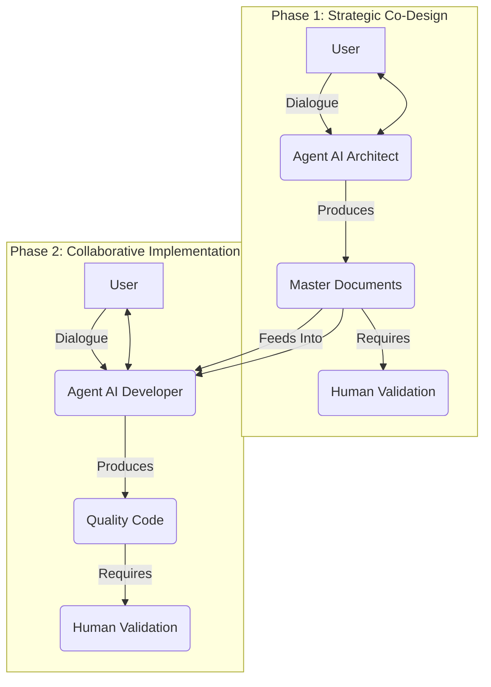

# Part 2: Philosophy of Collaboration

### Table of Contents

*   [Part 1: AI in Development](part1_intro_ai_development.md)
*   **Part 2: Philosophy of Collaboration**
*   [Part 3: Practical Guide to Kilo Code Setup](part3_practical_guide_kilo_code_setup.md)
*   [Part 4: Phase 1 – Holistic Planning](part4_phase1_planning_ai_architect.md)
*   [Part 5: Phase 2 – Collaborative Implementation](part5_phase2_implementation_ai_developer.md)
*   [Part 6: Best Practices for Synergy](part6_best_practices_synergy.md)
*   [Part 7: Critical Analysis of Methodology](part7_critical_analysis_methodology.md)
*   [Part 8: Conclusion – Augmented Development](part8_conclusion_augmented_development.md)
*   [Part 9: Resources and Community](part9_resources_community.md)

---

- **Part 2: Philosophy of Collaboration**
    - [From Passive Tool to Cognitive Augmentation](#from-passive-tool-to-cognitive-augmentation)
    - [AI Reimagined](#ai-reimagined)
      - [A Tireless Externalized Memory](#a-tireless-externalized-memory)
      - [A Demanding Sparring-Partner](#a-demanding-sparring-partner)
      - [A Creativity Catalyst](#a-creativity-catalyst)
      - [A Guardian of Coherence](#a-guardian-of-coherence)
    - [The Pillar of Our Method](#the-pillar-of-our-method)
    - [The Pillars of Effective Human-AI Synergy](#the-pillars-of-effective-human-ai-synergy)
    - [The Architecture of Collaboration](#the-architecture-of-collaboration)

---

### From Passive Tool to Cognitive Augmentation

Given the sometimes disappointing results when AI is **left to its own devices**, as we saw in the [previous part](part1_intro_ai_development.md), it's crucial not to throw the baby out with the bathwater. The potential of Artificial Intelligence to revolutionize how we create software remains immense. The key, however, lies in a **fundamental shift in perspective**: ceasing to see AI as a simple task executor to whom we passively delegate work, and instead considering it an instrument for **augmenting our own cognitive abilities**.

It's no longer about **commanding** code and hoping for a miracle, but about **forging an active and intelligent partnership** where AI's strengths – its processing power, access to information, systemic rigor when well-instructed – complement and amplify the irreplaceable strengths of the human developer: creativity, intuition, deep understanding of business context, and critical thinking. This part details the philosophy underpinning this vision of truly collaborative AI.

### AI Reimagined

The first step in this methodological transformation is to reimagine AI's role. Instead of confining it to a sophisticated **toolbox** or an improved **code generator**, we position it as an **extension of our own intellect**, an active partner capable of intervening at levels of strategic thinking well upstream of simple syntax production.

#### A Tireless Externalized Memory

One of the major cognitive challenges in any complex project is managing the sheer volume of information: evolving requirements, decisions made (and sometimes forgotten), technical constraints, countless functional details which, if overlooked, can have cascading consequences. Our human memory, however capable, has its limits and is prone to fatigue.
AI, on the other hand, excels at processing and storing vast contexts – a capability amplified by recent models with increasingly extended token windows. By **feeding** it in a structured and continuous manner with all project information (primarily via the four master documents we will co-create), it becomes a **nearly perfect, tireless, and instantly accessible externalized memory**. It can **remember** the finest details, complex dependencies between components, and help you maintain a coherent and up-to-date overall vision, where you might, alone, lose track or forget a crucial decision made weeks earlier.

#### A Demanding Sparring-Partner

In the design process, how often do we wish we could challenge our ideas with an expert, objective perspective, capable of playing devil's advocate to test their robustness and viability? AI, when specifically **prompted** for this, can brilliantly take on the role of a **demanding intellectual sparring partner**. It can, and should, be instructed to:
*   **Systematically question your fundamental assumptions:** *"You're assuming all users will have a stable internet connection for this feature. Is this an acceptable constraint for your target audience, or should we plan for a degraded or offline mode?"*
*   **Demand clarification for any ambiguity, however minor:** *"You mentioned an 'intuitive and modern interface.' Could you please define 2-3 objective criteria or concrete examples that would allow us to assess whether this goal is met?"*
*   **Explore counter-arguments and risks associated with a decision:** *"The architectural approach you're proposing is interesting for its initial simplicity. However, what would be the scalability challenges if the number of users triples in a year, as your projections indicate?"*
  
This adversarial dialogue, conducted constructively and systematically by the AI, is an extraordinarily powerful tool for sharpening your thinking, identifying weaknesses in your initial reasoning, and preventing design flaws that could prove very costly.

#### A Creativity Catalyst

When faced with a thorny design problem or searching for the best technical solution to implement a complex feature, AI can act as a formidable **creativity catalyst and a tireless explorer of the space of possibilities**. Drawing from its gigantic training database – which encompasses a considerable portion of accumulated human knowledge in code, algorithms, technical documentation, discussions on design patterns, and feedback from millions of projects – it can:
*   **Suggest innovative alternative solutions** you might not have considered, moving beyond the beaten paths of your own habits or technological comfort zone.
*   **Present relevant architectural or design patterns** for your specific use case, explaining their respective pros and cons.
*   Help you **rapidly explore the implications, prerequisites, and potential consequences** of different technical options, enabling you to make more informed choices.
It does not replace your own design creativity, but it can fuel it, stimulate it, unblock it when you're facing a wall, and significantly broaden the range of solutions you consider.

#### A Guardian of Coherence

Maintaining flawless coherence across hundreds of pages of specifications or within a distributed software architecture comprising multiple components is a significant challenge, even for the most organized teams. AI, thanks to its ability to analyze vast textual corpora, identify semantic relationships, and follow structuring rules, can become a **vigilant guardian of your project's coherence and an architect of its informational structure**. It can help you to:
*   **Identify logical contradictions or redundancies** between different requirements or sections of your specification documents.
*   **Ensure that decisions made in one area of design** (e.g., a technology choice in architecture) **are correctly reflected and accounted for in other areas** (e.g., in non-functional requirements or UI/UX specifications).
*   **Structure information logically, hierarchically, and in an easily navigable manner** within your project documents, using, for example, consistent naming conventions, unique requirement identifiers, and clear tables of contents.
In other words, it assists you in developing an **information architecture** for your project, which is just as crucial to its success as its technical architecture.

### The Pillar of Our Method

If the performance of a **Large Language Model** (**LLM**) is directly proportional to the clarity and richness of the context provided, and if creating this exhaustive context is precisely one of the most difficult and critical tasks for a developer working alone, then the most logical and powerful solution is to **make the genesis of this context a collaborative undertaking between human and artificial intelligence**. This is the fundamental pillar, the beating heart of our methodology.

We reject the approach of waiting until the coding phase to attempt to **brief** an AI on a project it is just discovering. We radically reverse the onus and the timing:
*   From the very beginning of a project, during **Phase 1** dedicated to planning and specification, we engage our specialized AI agent, the **Senior Solution Architect & Adaptive Partner**, in a process we term radical explicitation.
*   This agent is not a passive recipient of our ideas. Its system prompt is designed to make it a **proactive interlocutor, a tireless questioner**. It is instructed to push us, with method and rigor, to define every term, justify every assumption, explore every scenario, and quantify every expectation.
*   The goal of this intensive collaborative phase is not only for **us**, the humans, to achieve a better understanding of our own project. The goal is for us to produce, **hand-in-hand** with AI, a **foundational documentary corpus** (four master documents) of such richness, precision, and lack of ambiguity that it becomes **the ultimate context, the single and undeniable source of truth** for all subsequent development stages, including AI-assisted coding itself.

This is an essential paradigm shift: AI no longer passively **consumes** a context we would have painstakingly developed alone; it becomes an **active and intelligent partner in co-creating this context**. It helps us overcome our own cognitive biases, our natural tendency towards the implicit, or our potential oversights.

### The Pillars of Effective Human-AI Synergy

This philosophy of collaboration and this method of radical explicitation rest on a set of strong convictions, true pillars that our field experience has allowed us to validate:

1.  **The Quality of Planning Determines the Quality (and Cost) of the Final Product**
    This is an adage in software engineering, but it takes on a new dimension with AI. A significant investment in time, reflection, and rigor in the upstream specification and design phase, conducted in synergy with AI, is the most effective bulwark against project drift, costly implementation errors, and outright project failure. Every hour spent clarifying with AI in **Phase 1** can save ten hours of debugging or refactoring in **Phase 2**.
2.  **AI is a Lever for Rigor and Exhaustiveness, Not a Shortcut to Ease or Intellectual Laziness**
    Used correctly, AI does not exempt us from the effort of thinking, analyzing, and designing. On the contrary, it helps us to think **better**, more deeply, more structurally, and more exhaustively than we might alone, by confronting us with our own limitations.
3.  **The Human Developer Is and Remains the Strategic Mastermind and Ethical Guarantor**
    Specific business expertise, the overall product vision and its alignment with business objectives, the understanding of specific user stakes, disruptive creativity, ethical judgment, and final responsibility for decisions and their consequences reside with, and must reside with, the human developer. AI is an instrument of phenomenal power for amplifying this mastery, not for replacing it.
4.  **Active, Iterative, and Critical Dialogue is the Engine of Collaborative Performance**
    A simple instruction given to AI followed by text or code generation is not collaboration; it is delegation. True synergy arises from the continuous cycle of questioning (initiated by both AI and human), proposing, constructive critical analysis, joint refinement, and explicit validation. It is this demanding process that forges robust and genuinely adapted solutions.
5.  **Massive and High-Quality Explicit Context is the Indispensable Fuel for an Effective AI Coding Assistant**
    When an AI agent dedicated to implementation (like our **Senior Collaborative Full-Stack Developer**) can rely on exhaustive, precise, consistent, and validated design documentation (the four master documents), its ability to generate relevant, aligned with the architecture and needs, and high-quality code is multiplied. Its tendency to **drift** or **misunderstand** is then drastically reduced, transforming the AI-assisted coding experience.

### The Architecture of Collaboration

To translate this philosophy into operational practice, our methodology is clearly organized around **two interdependent and sequential phases**, each driven by an **AI agent specifically prompted** (i.e., configured with very detailed system instructions) for its role and responsibilities.

1.  **Phase 1**: Strategic Co-Design and Holistic Planning with the **Senior Solution Architect & Adaptive Partner**
    *   This agent is your primary intellectual partner for the most critical phase: the one where the raw idea is transformed into the project's detailed **blueprint**. It guides you, through a demanding and structured dialogue, in exploring and exhaustively formalizing requirements (functional and non-functional), designing the technical architecture, specifying every aspect of the user interface and experience (UI/UX), and rigorously modeling the data structure.
    *   **Key Deliverable of Phase 1:** A set of **four interdependent master documents**, co-created and validated: `MASTER_REQUIREMENTS_SPECIFICATION.md`, `SENIOR_ARCHITECTURE_DESIGN.md`, `SENIOR_UIUX_SPECIFICATION.md`, and `SENIOR_DATABASE_SCHEMA.md`. Together, they constitute the complete construction plan, the **single source of truth** for your project.

2.  **Phase 2**: Precise, Collaborative, and Evolutionary Implementation with the **Senior Collaborative Full-Stack Developer**
    *   Building upon the unshakeable foundations established in **Phase 1**, this agent, specialized in **Full-stack** development, actively assists you in translating these detailed specifications into high-quality source code.
    *   It helps you apply the defined architectural patterns, scrupulously respect **UI/UX** designs, and interact with the database according to the validated schema, all while proactively advising you on aspects of code quality, security, performance, and testability. It also helps you document the implementation process.
    *   **Key Deliverable of Phase 2:** The **functional source code** of your application, rigorously aligned with specifications, and whose creation has been assisted, documented, and qualitatively controlled in partnership with AI.

The transition from one phase to the next is a natural one: the robustness and completeness of **Phase 1** deliverables are the sine qua non condition for the effectiveness and serenity of **Phase 2**. Throughout this process, iteration within each task and explicit human validation of each major decision and each major artifact are non-negotiable constants.

---

In the [next part](part3_practical_guide_kilo_code_setup.md), we will delve into the practical guide for setting up Kilo Code and AI Agents.

**Previous Part :** [Part 1 : AI in Development – From Frustration to Synergy](part1_intro_ai_development.md)
