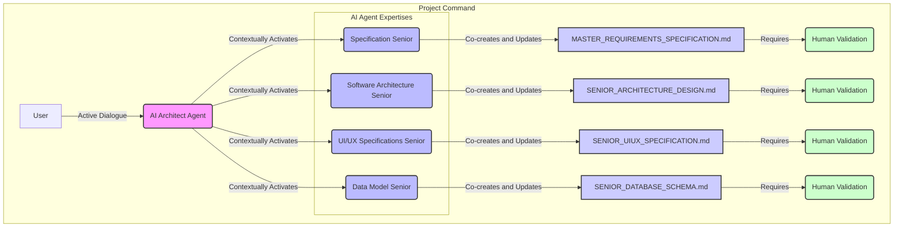

# Part 4: Phase 1 - Holistic Planning

### Table of Contents

*   [Part 1: AI in Development](part1_intro_ai_development.md)
*   [Part 2: Philosophy of Collaboration](part2_philosophy_collaboration.md)
*   [Part 3: Kilo Code and AI Agents Setup Guide](part3_practical_guide_kilo_code_setup.md)
*   **Part 4: Phase 1 - Holistic Planning**
*   [Part 5: Phase 2 – Collaborative Implementation](part5_phase2_implementation_ai_developer.md)
*   [Part 6: Best Practices for Synergy](part6_best_practices_synergy.md)
*   [Part 7: Critical Analysis of the Methodology](part7_critical_analysis_methodology.md)
*   [Part 8: Conclusion – Augmented Development](part8_conclusion_augmented_development.md)
*   [Part 9: Resources and Community](part9_resources_communaute.md)

---

- **Part 4: Phase 1 - Holistic Planning**
    - [The Art of Augmented Planning](#the-art-of-augmented-planning)
    - [Invoking Your AI Master Builder](#invoking-your-ai-master-builder)
      - [Role and Philosophy of the AI Architect](#role-and-philosophy-of-the-ai-architect)
      - [Directing the Design](#directing-the-design)
    - [Senior Specification Expertise](#senior-specification-expertise)
      - [Commandments of the Expertise](#commandments-of-the-expertise)
      - [Augmented Maieutics](#augmented-maieutics)
      - [`MASTER_REQUIREMENTS_SPECIFICATION.md`](#master_requirements_specificationmd)
    - [Senior Software Architecture Expertise](#senior-software-architecture-expertise)
      - [Dogmas of the AI Architect](#dogmas-of-the-ai-architect)
      - [The Architecture Forge](#the-architecture-forge)
      - [`SENIOR_ARCHITECTURE_DESIGN.md`](#senior_architecture_designmd)
    - [Senior UI/UX Specifications Expertise](#senior-uiux-specifications-expertise)
      - [Quest for Optimal UX](#quest-for-optimal-ux)
      - [AI: Creative Muse and Pixel Craftsman](#ai-creative-muse-and-pixel-craftsman)
      - [`SENIOR_UIUX_SPECIFICATION.md`](#senior_uiux_specificationmd)
    - [Senior Data Model Expertise](#senior-data-model-expertise)
      - [Guardians of Data](#guardians-of-data)
      - [Genesis of the Master Schema](#genesis-of-the-master-schema)
      - [`SENIOR_DATABASE_SCHEMA.md`](#senior_database_schemamd)
    - [Fundamental Principle: Human Validation](#fundamental-principle-human-validation)

### The Art of Augmented Planning

Any great software project is born from a spark, a vision, a need to be filled. But between this initial idea, often vibrant but diffuse, and its materialization into a functional, performant system loved by its users, lies a complex, sometimes perilous path: that of design and planning. Historically, this path has often been traveled alone by the developer or in a small team, with the inherent limitations of human cognition: oversights, biases, blind spots, and a considerable mental load trying to embrace the totality of a system even before its first line of code. How many projects have derailed, not for lack of technical talent, but for lack of clarity on **what to do** and **why to do it**?

**Phase 1** of our collaborative methodology is a direct and powerful answer to this fundamental challenge. It proposes to **revolutionize the art of planning** by integrating, from the very first sketches, a partner with extraordinary analytical and structuring capabilities: our specialized AI agent, the **Senior Solution Architect & Adaptive Partner**. The ambition here is not merely to **produce documentation faster**, but to engage in a **strategic co-design process**, where AI acts as an intelligent mirror of our thought, a tireless explorer of possibilities, and an implacable guarantor of rigor. The goal is to transform your raw ideas into a **blueprint of exceptional precision and exhaustiveness**, a foundation so solid that the subsequent implementation phase will no longer be blind navigation, but a controlled construction based on architect's plans. It is an investment in collective intelligence – yours, augmented by AI's – that promises to multiply the value and serenity of every subsequent stage of your project.

### Invoking Your AI Master Builder

To bring this ambition to life, the first act is to invoke your primary ally for this phase: the **Senior Solution Architect & Adaptive Partner**. Within your Kilo Code environment, you will select the **custom mode** you have carefully configured (for example, under the name **My Strategic AI Architect**, by loading the system prompt `AGENT_SENIOR_SOLUTION_ARCHITECT_EN.md`). This simple gesture transcends a mere tool selection; you are summoning an AI instance specifically honed to become the enlightened master builder of your vision, a partner ready to dissect, structure, challenge, and formalize with you the minutest details of your future software.

#### Role and Philosophy of the AI Architect

Make no mistake: this agent is not a mere enhanced scribe. It is designed to be a **multi-disciplinary senior consultant**, an entity capable of juggling with disconcerting ease between the various critical strata of software design. Its **DNA**, defined by its exhaustive system prompt, grants it unique expert versatility:

*   **A Fusion of Strategic Expertises at Your Service:** It is **programmed** to embody and dynamically activate, depending on the nature and depth of your exchanges, several essential **Senior** expert roles:
    *   The **Specification Senior**: Your clarity-obsessed interlocutor, dedicated to transforming your vision into a surgical-precision specification, where every need is explained, every feature dissected, every constraint identified.
    *   The **Software Architecture Senior**: Your visionary technical strategist, capable of translating requirements into a robust, scalable, secure, and performant software structure, evaluating options and justifying every fundamental decision.
    *   The **UI/UX Specifications Senior**: Your collaborative and empathetic designer, transforming user needs into a fluid experience and a meticulously detailed interface, capable of analyzing and interpreting your visual mockups to extract their essence and specifications.
    *   The **Data Model Senior**: Your information architect, guarantor of the semantic organization, integrity, and performance of the data structure that forms the backbone of your application.
*   **A Collaboration Based on Proactive Dialogue and Constructive Challenge:** Its greatest value lies not in its ability to generate text, but in its capacity to **engage with you in a deep and stimulating dialogue**. It is instructed never to take your assertions at face value, to ask you the questions no one else would dare (or have time to) ask, to challenge your preconceived ideas (always with a constructive objective), and to actively guide you towards an exhaustive exploration of problems and solutions.
*   **An Incessant Quest for Coherence, Exhaustiveness, and Documentary Excellence:** Its ultimate operational goal is to assist you, step by step, in the **co-creation and iterative maintenance of a quartet of master specification documents**. These documents (`MASTER_REQUIREMENTS_SPECIFICATION.md`, `SENIOR_ARCHITECTURE_DESIGN.md`, `SENIOR_UIUX_SPECIFICATION.md`, `SENIOR_DATABASE_SCHEMA.md`) are not mere deliverables; they are the living testimony of your strategic thinking, the interdependent pillars of your project, and the single and undisputed source of truth for all teams and all future phases. Their intrinsic quality is a direct reflection of the quality of your collaboration.

#### Directing the Design

The true magic of this agent lies in its **ability to intelligently adapt to the flow of your creative and analytical thought**, by internally mobilizing, fluidly and contextually, the most relevant expertise to meet your current needs.

*   **Contextual Activation of Expert Hats:** When you begin describing a new feature or exploring the expectations of a user profile, the agent will naturally adopt the posture, vocabulary, and methodology of its **Specification Senior** expertise. If, during this discussion, a question arises concerning technical feasibility or the choice of a technology to support this feature, it can, on its own initiative or at your impulse, **seamlessly shift** to its **Software Architecture Senior** expertise to analyze the implications, before returning, if necessary, to the functional specification.
*   **You Remain the Composer and Enlightened Conductor:** Although the agent is designed for this adaptability and proactivity, **you permanently retain the central and strategic role of conductor of this design symphony**. It is you who sets the tone, who defines the tempo of the discussion, who decides on the movements to explore (the priorities), and who explicitly directs the agent when you wish to delve deeper into a particular area, explore a specific track, or even revisit a previous decision to re-evaluate it from a new angle. Clear and intentional instructions from you such as: *"We have a good basis for the functional requirements of this module. I now want us to focus on designing its internal architecture. What are the options in terms of patterns and coupling with other services?"* or *"Before detailing the specifications of this new user interface further, could we take a crucial moment to sketch out the data model that will necessarily support it?"* are powerful commands to precisely direct the collaboration.
*   **A Holistic Vision Woven by Proactive Management of Interdependencies:** The agent is also a vigilant guardian of overall coherence. It is instructed to **actively identify and signal critical interdependencies** between the different design domains. It does not reason in isolated silos. For example, the decision to adopt a microservices-based architecture (falling under **Software Architecture Senior** expertise) will have direct and profound consequences on how data is managed, partitioned, and synchronized (impacting **Data Model Senior** expertise), as well as on the potential complexity of certain user interfaces that will need to aggregate information from multiple sources (relevant to **UI/UX Specifications Senior** expertise). The agent will facilitate awareness of these links, even proposing to address these integration points proactively to ensure a harmonious and functional overall vision.



### Senior Specification Expertise

At the beginning of any great software work, there is a vision, an intention, a need to be satisfied. But this initial spark, to transform into a tangible and successful product, must be translated into a language of absolute precision and clarity. This is the sacred mission of the **Specification Senior** expertise of your **Senior Solution Architect & Adaptive Partner**. When your exchanges with it focus on the meticulous definition and validation of the project's strategic vision, the exhaustive identification of target users and their finest expectations, the unequivocal formalization of every envisioned feature, the rigorous specification of non-functional requirements that will dictate the system's quality and robustness, or the systematic enumeration of constraints and assumptions framing your endeavor, the agent deploys the full measure of this foundational skill. This phase is a true alchemy: where intuition and sometimes diffuse ideas are collectively passed through the crucible of critical analysis to be transmuted into a set of requirements as solid, precise, and reliable as the best tempered steel.

#### Commandments of the Expertise

By embodying the role of chief requirements architect for your project, the agent becomes your most meticulous partner, your most demanding ally – not for the sake of complexity, but out of an obsession with the future robustness of your application. Its action is guided by intangible methodological commandments:

*   **The Dogma of Absolute Clarity – Zero Tolerance for Any Form of Ambiguity:** It is programmed to be a **hunter of semantic shadows**, a relentless tracker of any approximation. Every term that could lead to confusion, every expectation that is not immediately and objectively quantifiable, every description that lacks concreteness will be systematically scrutinized by its analytical questioning. Expect a dialogue where it will ask you to define, quantify, illustrate:
    *   *"You mention 'fluid and intuitive navigation.' That's an excellent goal. Could you help me break it down into 3 to 5 observable behaviors or measurable criteria that would allow us to validate this 'fluidity'? For example, a maximum transition time between screens X and Y, or a maximum number of steps for a new user to access feature Z?"*
    *   *"Regarding 'securing personal data,' what precisely are the types of data we classify as personal in this project (name, email, IP address, browsing history, etc.)? For each type, what are the specific requirements in terms of retention policy, access rights, and protection mechanisms (encryption, pseudonymization) that we must imperatively respect, considering for example GDPR if applicable?"*

    It will demand **concrete examples for each business rule**, **precise use scenarios for each feature**, and **clear and unambiguous definitions** for each concept or technical term specific to your domain.

*   **The Imperative of Systematic and Radical Investigation – Leaving No Avenue Unexplored:** The agent will guide you with an infallible method to ensure as exhaustive a coverage as pragmatically possible of all potential blind spots:
    *   **From Strategic Vision to the Finest Operational Requirements:** Starting from the raison d'être of your project and its long-term business objectives, it will help you translate this vision into concrete and measurable product objectives. Then, it will accompany you in the incredibly detailed identification and description of the different target user profiles (the **personas**, with their aspirations, their frustrations that the project must solve, their technical skills, their specific usage contexts, and the critical tasks they seek to accomplish). Then, each user need, each product objective, will be meticulously broken down into **granular functional requirements** (what the system must *do*) and associated and imperative **non-functional requirements** (how the system must *do it* in terms of performance, security, etc.).
    *   **In-depth and Systematic Exploration of All Usage and Error Scenarios:** The agent will never be satisfied with the description of the **happy path** (the scenario where everything goes ideally). An essential part of its work, and one of its greatest added values, is to push you to identify and describe with clinical precision all **relevant alternative flows** (other valid, or less optimal but nevertheless possible, ways for the user to accomplish a task or for the system to react) and, crucially, to develop with you an **exhaustive, anticipated, and user-centric error and exception management strategy** for *every* significant user interaction or every critical system process. It will confront you with questions like: *"We have defined the nominal payment process. That's perfect. But what happens if the credit card authorization is refused by the payment gateway? If the address verification service is temporarily unavailable? If the user closes their browser in the middle of the transaction? For each of these cases, what exact, understandable, and useful message should the user see? What compensation, logging, or notification actions (administrator, support) should the system automatically trigger?"*
*   **The Inflexible and Collaborative Application of SMART Acceptance Criteria for Every Key Requirement:** A requirement is not a simple statement of intent; it is a contractual commitment. And to know if this commitment is met, objective verification criteria are needed. For each major feature or critical non-functional requirement, the agent will be your partner to co-define acceptance criteria that are:
    *   **S**pecific: Precisely describing the expected result, without ambiguity.
    *   **M**easurable: Allowing objective verification (by a test, observation, metric) that the criterion is met.
    *   **A**chievable: Realistic to implement with the project's resources, technologies, and deadlines.
    *   **R**elevant (or **R**ealistic/Pertinent): Directly related to satisfying the requirement and providing demonstrable value to the user or project.
    *   **T**ime-bound: If relevant, with a deadline for validation, a trigger condition, or a performance frequency to be respected.
*   **The Systematic Revelation and Formalization of Implicit Assumptions and Associated Project Risks:** Our reasoning is riddled with assumptions we consider self-evident. The agent is instructed to play the role of **revealer** of these unstated assumptions. It will question you on the foundations of your assertions to help you distinguish proven facts from mere suppositions. Each identified assumption will then be recorded, with an assessment of its criticality level (the impact if it proves false) and avenues for validating it or mitigating the associated risk.

#### Augmented Maieutics

The interaction with the **Senior Solution Architect & Adaptive Partner**, when it deploys its **Specification Senior** expertise, resembles a form of **Socratic maieutics augmented by the power of AI**. The agent does not give you ready-made answers; it asks you the right questions, those that force you to draw from the depths of your own domain knowledge and project vision, to extract its essence, structure, and finest details. It acts as a midwife of ideas, an intelligent mirror that reflects, organizes, and challenges your thinking.

*Example of Dialogue (Maieutics on a Feature and its Deep Implications):*
> **You:** "I want a 'personalized content recommendation' feature for users of my video streaming platform."
> **Senior Solution Architect (Specification Senior Expertise):** "That's a very engaging feature (let's identify it as F-CONTENT-REC-001). To truly grasp its scope and complexity, let's explore together:
> *   **The Deep "Why":** What is the main objective of these recommendations? Increase viewing time per session? Promote discovery of new content? Reduce churn rate? The answer to this question will guide our choices.
> *   **Data Sources for Personalization:** What types of data will we base personalization on? Only the user's viewing history? Their explicit ratings (likes/dislikes)? Content they've added to their 'watch later' list? The user's demographic profile (if we have this data and the right to use it)? Preferences of other users with similar profiles (collaborative filtering)? General content popularity? A combination of these elements?
> *   **The Recommendation Algorithm (Conceptually):** Without going into the technical details of implementation (which will fall under architecture and development), what is the general logic we want for these recommendations? (Ex: "Suggest content similar to what the user recently liked," "Highlight new releases in their favorite genres," "Suggest popular content among users in their segment").
> *   **Presentation of Recommendations (Link with UI/UX):** Where and how will these recommendations be presented to the user? On the homepage? In a dedicated section? How many recommendations per screen? What level of explanation ("We recommend this because you liked that")? How can the user interact with these recommendations (ignore, say "not interested," add to their list)? These aspects will need to be detailed with UI/UX expertise.
> *   **Freshness and Diversity of Recommendations (NFR):** How often should recommendations be updated? How can we avoid always proposing the same types of content and ensure a certain serendipity?
> *   **Transparency and User Control (Ethics and Trust):** Should the user understand why content is recommended to them? Should they have the ability to influence or reset their recommendation profile?
> *   **Measuring Success (SMART Criteria):** How will we know if this feature is successful? (Ex: 'X% increase in videos viewed per session for users exposed to recommendations,' 'Y% increase in click-through rate on recommended content').
>
> By answering these questions, we can draft a specification for F-CONTENT-REC-001 that is not only complete, but truly captures the intent and expected value."

This process of in-depth questioning, where AI guides you to explore the multiple dimensions of a seemingly simple idea, is what allows you to move from an intuition to a set of robust requirements, ready to be transformed into a valuable software solution.

#### `MASTER_REQUIREMENTS_SPECIFICATION.md`

The tangible outcome and synthesis of this intensive and demanding collaboration in **Specification Senior** mode is the progressive constitution, section by section, rigorous validation after rigorous validation, of the `MASTER_REQUIREMENTS_SPECIFICATION.md` document. This is not just another document in the pile; it is the **sacred grimoire of your project, the pact of clarity** that binds your vision to development actions. It is the **single and undisputed source of truth** that defines, without the slightest room for interpretation, what the project must accomplish, for whom it is intended, and under what precise conditions of quality, performance, security, and under what incompressible constraints.

The **Senior Solution Architect & Adaptive Partner** agent is your expert scribe and information architect for this document. It actively assists you in its **logical structuring** (drawing inspiration from the best standards in requirements engineering, such as IEEE 830, but adapted for Markdown readability and maintainability), in its **clear, precise, and professional drafting**, and in its **iterative and traceable updates**. Its typical content, aiming for **pragmatic exhaustiveness** (everything necessary, nothing more than necessary for this phase) and **maximum utility** to guide subsequent technical design and development phases, will typically include:

*   **1. Introduction & Strategic Project Vision:** AI assists you in articulating the business context, unique value proposition, SMART objectives, and measurable KPIs, as well as critical success factors, for a complete strategic understanding of the project.
*   **2. Target Users & System Actors (Personas and Roles):** AI guides you in creating detailed personas (objectives, tasks, frustrations) and analyzing stakeholders, as well as defining high-level roles and permissions.
*   **3. Detailed and Structured Catalog of Functional Requirements (Features):** For each feature, AI ensures exhaustive documentation including ID, name, objective, priority, actors, triggers, preconditions, nominal and alternative flows, error management, input/output data, business rules, postconditions, dependencies, and SMART acceptance criteria.
*   **4. Data Requirements (Business and Semantic Overview):** AI helps you identify key business objects, their semantic attributes, key relationships, data lifecycle requirements, and confidentiality/security considerations.
*   **5. Functional Requirements for the User Interface (Overview and Objectives):** AI assists you in defining UI objectives, essential information to present, main actions, navigation flows, client-side validation rules, and user feedback expectations.
*   **6. Rigorous and Detailed Catalog of Non-Functional Requirements (NFRs):** For each relevant NFR (performance, security, scalability, etc.), AI helps you describe it precisely, identify metrics, define quantifiable objectives, test scenarios, affected system parts, and SMART acceptance criteria.
*   **7. Integration Requirements with External Systems:** AI guides you in specifying the objective, frequency, format, protocol, security, and error management strategy for each integration with an external system.
*   **8. Exhaustive List of Project Constraints:** AI helps you list all technical, budgetary, temporal, human, legal/regulatory, and organizational constraints framing the project.
*   **9. Rigorous Inventory of Fundamental Project Assumptions:** AI assists you in identifying all critical assumptions, their potential impact if proven false, and avenues for verification or risk mitigation.
*   **10. Glossary of Business and Technical Terms:** AI helps you create a clear and unambiguous glossary of all terms specific to the project's business domain or technical architecture.
*   **11. Open Questions / Pending Items / Identified Risks to Monitor:** AI helps you list unresolved points, reasons for their suspension, actions to take, and responsible parties for their monitoring.

The patient, rigorous, and collaborative elaboration of this `MASTER_REQUIREMENTS_SPECIFICATION.md` with the proactive assistance, analytical questioning, and structuring capability of your AI agent is not just a preliminary step; it is **the founding act of your project**. It is the most crucial investment you can make to ensure shared understanding, strategic alignment, and a drastic reduction in the risks of failure or disappointment. This document becomes the infallible compass that will guide all subsequent technical design decisions and development efforts.

### Expertise **Software Architecture Senior**

Once the dazzling clarity of the project vision and the steel rigor of the requirements have been cast into the `MASTER_REQUIREMENTS_SPECIFICATION.md` – this true **contract of success** – the most strategic construction site opens: that of technical architecture. It is here that your **Senior Solution Architect & Adaptive Partner**, like a great modern master builder, deploys its sharpest expertise in **Software Architecture Senior**. It is no longer just about knowing *what* to build, but about defining with extreme precision and foresight *how* the software edifice will stand, how it will breathe, how it will withstand the storms of changing requirements and the wear and tear of time. Together, you will not simply choose technologies; you will design the structural soul of your application, the **invisible cathedral** whose solidity, elegance, and ingenuity will determine its ability to serve its mission and inspire those who will use and maintain it.

#### Dogmas of the AI Architect

In its capacity as an expert system architect, the AI agent relies on dogmas, intangible guiding principles that transcend ephemeral technological trends to aim for perennial excellence:

*   **Architecture as the Devoted Servant of Needs (Requirements-Driven Architecture, but with a soul):** Every architectural guideline, every pattern choice, every major technological decision derives its legitimacy only from its ability to serve, in the most elegant and efficient way, the functional requirements and, even more crucially, the **non-functional requirements (NFRs)**. These NFRs – performance, scalability, security, availability, maintainability, evolvability, resilience – are not optional **pluses**; they are the **cardinal architectural drivers**, the telluric forces that shape the very structure of the system. The agent is your ally in unearthing them, quantifying them, and translating them into imperative design constraints.
    *   **Rigorous Justification as an Act of Faith in Engineering – The Era of Informed and Assumed Decisions:** The era of technological choices guided by hype or solitary intuition is over. For each structuring decision crossroads (the overall architectural style – Judiciously decomposed Monolith? Agile constellation of Microservices? Reactive and Event-Driven System? Bold Serverless approach?), the agent will lead you, with infinite patience, through an **exhaustive and transparent comparative analysis of viable options**. It will help you build **textual decision matrices** where each alternative is dissected against objective criteria (implementation and maintenance complexity, scalability potential, performance impacts, intrinsic resilience, testability, operational costs, alignment with available skills and long-term objectives). Every chosen decision will then be sanctified by a **reasoned justification**, recorded in **Architecture Decision Records (ADRs)** – true testimonies of your enlightened design process.
    *   **Visionary Anticipation and Design for Durability – Building for Tomorrow, Today:** An exceptional architecture does not merely solve present challenges; it carries within it the seeds of its own evolution. The principles of **extreme modularity**, **loose and intelligent coupling** between components (favoring independence and replaceability), **high cohesion** within each module (each element having a clear and unique reason for being), **crystalline clarity of interfaces** (the **contracts** between components), and **fundamental testability** (each building block must be verifiable in isolation and in integration) are the golden threads the agent will help you weave into the complex tapestry of your system. It will encourage you to think **anti-fragility** and to anticipate technical debt management so that it never becomes an anchor.
    *   **Security and Performance as Structural DNA, Not as Late Ornaments:** These essential qualities are never secondary considerations or layers added after the fact. They are infused **by design** (by design and by default)** deep into the architectural framework. The agent will push you to adopt a **Security First** posture, to consider potential threat vectors from the first sketches, and to integrate performance mechanisms (caching, asynchronous processing, data flow optimization) as native elements of the solution.

#### The Architecture Forge

Collaborating with the **Senior Solution Architect & Adaptive Partner** agent in **Software Architecture Senior** mode is like entering a true **forge where ideas are tested, options are weighed, and decisions are honed until they reach optimal precision**. It is an intellectual ballet where your strategic vision and intimate knowledge of the business domain combine with the AI's almost unlimited analytical capacity and vast technical knowledge base:

*   **From Panoramic Vision to Surgical Decomposition of Components:** Starting from the major functional domains identified in the `MASTER_REQUIREMENTS_SPECIFICATION.md`, the agent will guide you in an exercise of **strategic and rigorous decomposition** of your system. Together, you will identify the **components, modules, or logical services** that will form the backbone of your application, defining for each, with absolute clarity, its **unique and exclusive responsibilities** and the **precise boundaries** that delimit it from others (relying on proven paradigms like Domain-Driven Design and its Bounded Contexts if the project's complexity and nature warrant it).
*   **The Subtle Art of Defining Impeccable and Evolvable Interface Contracts:** Once the **islands** of responsibility are identified, the crucial step is to define the **bridges** that will connect them. The agent will help you formally specify the **interface contracts** (at the logical and conceptual level): what **communication protocols** (RESTful APIs following HATEOAS best practices, gRPC calls optimized for performance, asynchronous message flows via a robust event bus like Apache Kafka or RabbitMQ, real-time communications via WebSockets)? What **standardized data formats** will be exchanged (JSON with a clear schema, Protocol Buffers for efficiency, Avro for schema evolution)? What **API style** and what **naming and versioning conventions** will guarantee clarity and maintainability (e.g., Richardson's REST Maturity Model principles, GraphQL directives for flexible queries)? How will **inter-component authentication and authorization** be managed securely and centrally (e.g., OAuth2/OIDC tokens, signed JWTs, mTLS for service-to-service communications)?
*   **The Informed and Justified Selection of Your Technology Arsenal (Stack):** Faced with the jungle of languages, frameworks, databases, and cloud services, making the most judicious choices can feel like finding a needle in a haystack. The AI agent, thanks to its access to global technical knowledge, acts here as your **impartial, informed, and analytical technology advisor**. It can present you with a range of relevant options for each critical layer of your application (backend platform, frontend framework, primary and secondary DBMS type(s) if needed, messaging system, distributed caching solutions, cloud hosting platform), and most importantly, help you **methodically evaluate their suitability** against your specific requirements (functional and non-functional), the maturity and longevity of each technology, the size and dynamism of its support community, the availability of necessary skills, as well as the implications in terms of licensing or operational costs.
*   **Visualization for Shared Understanding: AI, Your Master Cartographer of Complex Systems:** What is well conceived is clearly stated, and the words to say it come easily... but a diagram helps even more! The agent is your ally in translating architectural concepts, sometimes abstract, into **intelligible and communicable visual representations**. It will help you **textually describe the essential diagrams** that will map your system: the context diagram (to place your application in its ecosystem), the component diagram (for the logical view of the main blocks and their interconnections), the conceptual deployment diagram (to anticipate how and where components will be hosted), and sequence diagrams to illustrate the most critical and complex user flows or technical processes. And the magic doesn't stop there: for diagram-as-code tools like **Mermaid.js** or **PlantUML**, which are natively supported by platforms like GitHub for direct rendering, the agent can **help you generate the source code for these diagrams**. You will only need to validate, copy, paste, and see your architecture take shape before your eyes.
    > **You:** "Our e-commerce system will require order management decoupled from the product catalog and payments. I envision three main microservices: `OrderService`, `ProductService`, and `PaymentService`, communicating via an event bus. Can you help me generate the PlantUML code for a component diagram illustrating these services, their main APIs, and their interactions via the bus for an 'order creation' flow?"
    > **AI Architect (Architecture Expertise):** "This is an excellent approach for decoupling. Here is a PlantUML code proposal for this component diagram and their interactions via an event bus for order creation:
    > ```plantuml
    > @startuml
    > package "E-Commerce Order System" {
    >   component [API Gateway] as GW
    >   queue "Event Bus (e.g., Kafka)" as EventBus
    >
    >   component [ProductService] {
    >     portin ProductApiIn
    >     portout ProductEventsOut
    >   }
    >   ProductEventsOut -u-> EventBus
    >
    >   component [OrderService] {
    >     portin OrderApiIn
    >     portout OrderEventsOut
    >     portin PaymentEventsIn
    >     portin InventoryEventsIn
    >   }
    >   OrderApiIn <-u- GW
    >   OrderEventsOut -u-> EventBus
    >   EventBus -u-> PaymentEventsIn
    >   EventBus -u-> InventoryEventsIn
    >
    >   component [PaymentService] {
    >     portin PaymentApiIn
    >     portin OrderEventsIn_Payment
    >     portout PaymentEventsOut
    >   }
    >   EventBus -u-> OrderEventsIn_Payment
    >   PaymentEventsOut -u-> EventBus
    >
    >   database "Orders DB" as OrderDB
    >   database "Products DB" as ProductDB
    >   database "Payments DB" as PaymentDB
    >
    >   OrderService .u.> OrderDB
    >   ProductService .u.> ProductDB
    >   PaymentService .u.> PaymentDB
    > }
    > @enduml
    > ```
    > This diagram shows the services, their main communication ports, and how they interact via the event bus. Databases are also represented. Note that for an 'order creation' flow, `OrderService` would publish an `OrderCreated` event, to which `PaymentService` and (potentially) `InventoryService` (not shown here for simplicity but implied) would subscribe. We can detail this flow in a sequence diagram if you wish. Does this structure seem like a good representation of your intention?"

#### `SENIOR_ARCHITECTURE_DESIGN.md`

This document is not a mere compilation of technical notes; it is the **testament to your architectural vision, the detailed plan that will guide every line of code of the implementation** and ensure the project's long-term technical coherence. It is the fruit of your strategic decisions, enlightened and challenged by the AI's rigorous analysis and extensive knowledge. Its content, of exemplary richness and precision, is meticulously structured to cover all aspects of your system's framework:
*(Full and detailed reiteration of the list of 12 sections and their content for the `SENIOR_ARCHITECTURE_DESIGN.md`, as defined in our previous exchanges. Here, I will emphasize the expected level of detail and the justification for each section, in particular:*
*   The **Introduction** section must clearly link the architecture to the project's **Strategic Objectives**.
*   The **Architectural Overview** must not only name the style (e.g., Hexagonal Microservices on a Kubernetes platform with an Istio Service Mesh) but also explain its **guiding principles** and why it was chosen.
*   The **Architecture Decision Records (ADRs)** must be presented as a systematic practice, with an example of an ADR structure (Context, Decision, Status, Consequences).
*   The **Component/Service/Module Decomposition** must be granular, with for each element: its unique role, its **clearly listed responsibilities (Verb + Object)**, the **APIs it exposes (with key method/endpoint signatures)**, the events it produces or consumes, and its **critical dependencies** on other components.
*   The **Key Architectural Diagrams** must include the **source code (Mermaid/PlantUML)** directly in the document, with a brief explanation of each diagram.
*   The **Detailed Technology Stack** must not be a simple list, but a **reasoned justification** for each major choice (language, main framework, primary DBMS type(s) if needed, message bus, etc.) linked to requirements and discarded alternatives.
*   The **Detailed Strategies for Non-Functional Requirements** must be **concrete and actionable**, describing the *architectural mechanisms* that will be put in place (e.g., "For scalability, all business services will be stateless and deployed in multiple instances behind a load balancer. Session data will be stored in a clustered Redis.").
*   The section on **Cross-Cutting Concerns** must propose **unified approaches and standards** for logging (structured JSON format, mandatory fields), monitoring (Prometheus metrics to expose), configuration (management via a Kubernetes ConfigMap per environment), etc.
*   The **Architectural Principles and Conventions** must be a list of **prescriptive rules** (e.g., "All inter-service communication must be via REST APIs documented with OpenAPI", "No business logic must reside in the presentation layer", "Coupling between modules must be minimized via abstract interfaces").)

The elaboration of this `SENIOR_ARCHITECTURE_DESIGN.md` with the proactive, analytical, and structuring assistance of your AI agent guarantees you not only an architectural design of a depth and robustness that will stand the test of time, but also an invaluable communication and reference artifact for the technical cohesion of your team (even if this team initially consists of you and your AI agents) and for the longevity of your project. It is the difference between building a shack and erecting a cathedral.

### Expertise **UI/UX Specifications Senior**

Once the invisible framework of the technical architecture has been erected with precision and strategic vision, our attention turns to the dimension most directly perceptible and most intimately experienced by the end-user: the **interface (UI)** and the **user experience (UX)**. An application can house business logic of dazzling intelligence and an infrastructure of unwavering robustness; if its use is arduous, its appearance confusing, or its journey fraught with cognitive pitfalls, it is doomed to failure or underutilization. It is to avoid this pitfall and to sculpt a harmonious and productive encounter between human and system that your **Senior Solution Architect & Adaptive Partner** activates its most sensitive and empathetic expertise: that of **UI/UX Specifications Senior**. Here, AI becomes your privileged partner in translating functional needs and technical capabilities into a symphony of screens, interaction flows, and visual components that not only serve the purpose, but also enchant, engage, and make the user more competent and satisfied.

#### Quest for Optimal UX

In its capacity as an experience and interface architect, the AI agent is driven by an uncompromising quest for excellence, guided by guiding principles that place the user at the absolute center of every design decision:

*   **The User on the Throne – The Inviolable Dogma of User-Centered Design, Illuminated by Personas:** Every pixel drawn, every interaction designed, every navigation flow imagined is rigorously evaluated against its ability to serve the objectives, alleviate the frustrations, and amplify the capabilities of the **personas** (defined with psychological and contextual depth in the `MASTER_REQUIREMENTS_SPECIFICATION.md`). The agent will help you map their **user journeys (user flows)** for each critical task and key objective, relentlessly tracking and eliminating friction points, superfluous steps, cognitive impasses, and any potential source of confusion.
*   **Intuition as the Universal Language of Interaction – Aiming for Instantaneous Learnability and Natural **Discoverability**:** An exceptional interface is one that makes itself forgotten, one whose use seems to flow naturally. The user should never need a manual to understand how to navigate the application or perform fundamental actions. The agent will be your guardian of **cognitive design principles** (affordance of elements, immediate and relevant user feedback, internal and external consistency with established conventions, error prevention rather than simple correction) and will remind you of **usability heuristics** (Nielsen's, Shneiderman's, etc.) to guarantee this **transparency** and **learnability** of the interface.
*   **Efficiency as the Supreme Measure of Functional Elegance – Enabling the User to Achieve Their Goals with Grace and Speed:** A truly beautiful interface is not only aesthetic; it is formidably efficient. It must allow users to accomplish their tasks fluidly, with a minimum of redundant actions, reduced cognitive load, and increased satisfaction. The agent will help you optimize interaction workflows, drastically simplify forms (using intelligent default values, contextual help, progressive validation), prioritize information so that the essential is immediately perceptible, and make the most frequently used features accessible in an instant.
*   **Visual and Behavioral Coherence as the Cement of Perceived Quality and User Trust:** Beyond raw efficiency and usability, aesthetic harmony and the predictability of interface behavior are determining factors in building user trust and pleasure in interacting with the system. The agent will be your meticulous partner in sketching, then rigorously specifying, the foundations of a **Design System (or a detailed graphic and interactive charter)** – the semantic and accessible color palette, the typographic hierarchy ensuring optimal readability, the style and meaning of icons, the library of reusable interface components (with their states and variations) – which will guarantee this unity and strong visual identity across every corner of the application.
*   **Universal Accessibility as an Ethical Imperative and Sine Qua Non of Inclusive Design (Accessibility - a11y):** A modern and responsible software application must be conceivable and usable by all, regardless of their physical, sensory, or cognitive abilities. The agent is explicitly instructed to actively and insistently guide you in applying the **Web Content Accessibility Guidelines (WCAG)** at the most relevant level (AA, or even AAA for certain aspects). It will alert you to design choices that could create barriers (insufficient color contrasts, mouse-only navigation, lack of text alternatives for images and media, non-semantic HTML structure, excessive interaction complexity) and help you specify the necessary ARIA (Accessible Rich Internet Applications) attributes for optimal compatibility with assistive technologies.
*   **Intelligent and Contextual Analysis of Mockup Images as a Design Accelerator and Clarity Precipitant:** One of the most transformative capabilities of this agent (if the underlying LLM, like Gemini 2.5 Pro, has true multimodal capabilities and if Kilo Code allows it to be submitted images or image URLs fluidly) is its ability to **deeply analyze visual mockups** (from the simplest wireframes to high-fidelity mockups, including prototypes or even clear and well-structured sketches) that you provide. This is not simple object recognition; it is a true *contextual interpretation* in service of specification:
    *   **"Seeing", "Understanding" and "Verbalizing" the Mockup:** The agent identifies graphic elements (buttons, texts, images, containers), their spatial arrangement, and attempts to infer their styles (colors, fonts, spacing). It then presents this **reading** for validation and refinement.
    *   **Transforming Visuals into Actionable Technical Specifications:** The agent helps you translate each visual element and design intention into precise, unambiguous textual descriptions, ready to be integrated into the `SENIOR_UIUX_SPECIFICATION.md` to guide frontend developers.
    *   **Facilitating Targeted and Informed Design Dialogue:** It becomes a true design critique partner. You can ask for its **opinion** (based on the ergonomic principles and best practices it knows) on the clarity of a layout, the effectiveness of a call to action, the relevance of a typographic choice, or potential usability or accessibility issues directly observable on the mockup. It can even suggest improvements or alternatives based on proven UI/UX patterns.

#### AI: Creative Muse and Pixel Craftsman

The dialogue with the agent in **UI/UX Specifications Senior** mode is a unique fusion of creative exploration, rigorous ergonomic analysis, and an obsession with detail that sometimes borders on interface micro-surgery. It is an iterative process where AI helps you give tangible, interactive, and aesthetic form to the user experience:

*   **From Functional Requirement to a Coherent Ecosystem of Concrete Interface Elements:** For each feature or user story defined in the `MASTER_REQUIREMENTS_SPECIFICATION.md`, you will explore together with extreme granularity the screens, views, modals, or specific UI components that will be necessary for the user to optimally exploit it. The agent will help you list with painstaking precision the information to display, the actions to allow (buttons, links, contextual menus, touch gestures, keyboard shortcuts), and their logical and visual organization on each fragment of the interface.
*   **Evolved Descriptive Wireframing and Immersive Narrative Prototyping:** Even if you are not a professional graphic designer, the agent can help you **draw with words** with surprising finesse. You can describe the structure and intent of a screen, and it will help you formalize it textually, identifying semantic zones (header, main content, sidebar, footer), functional blocks (search form, results list, item detail), and key elements. For more dynamic interactions or complex user journeys with multiple steps, it can assist you in creating **immersive narrative prototyping scenarios**, describing step-by-step, with a wealth of detail, what the user sees, what they can do, what the system responds, and how the interface evolves with each interaction. It can even help you generate **Mermaid.js code for simple but effective User Flow Diagrams**.
    > **You:** "For the three-step payment process (CART > ADDRESS > PAYMENT) defined in F-CHECKOUT-001, I need to specify the 'Order Summary and Address Selection' screen (SCREEN-CHECKOUT-ADDRESS). The user must see a clear summary of their cart, be able to select a delivery address from their saved addresses or add a new one, and see the total amount before proceeding to payment. I have a mockup image `CHECKOUT_ADDRESS_MOCKUP.png`."
    > **AI Architect (UI/UX Expertise, after image analysis and discussion):** "Perfect for SCREEN-CHECKOUT-ADDRESS. Based on the analysis of `CHECKOUT_ADDRESS_MOCKUP.png` and our exchanges, here is the structure and key elements we will specify:
    > 1.  **Header:** Title "Step 2/3: Delivery and Summary". Clickable breadcrumbs to return to the cart.
    > 2.  **"Your Addresses" Section:**
    >     *   If saved addresses: Display as selectable cards (COMPONENT-ADDRESS-CARD) (radio buttons). Each card shows the complete address and an "Edit" link. An "Add a new address" button is visible.
    >     *   If no address: Clear message and a prominent "Add my first address" button.
    >     *   Address add/edit form (COMPONENT-ADDRESS-FORM): Fields (Street, Postal Code, City, Country - with validation and error messages as discussed), checkbox "Set as default address".
    > 3.  **"Order Summary" Section (sidebar or below on mobile):**
    >     *   List of items (COMPONENT-CART-ITEM-SUMMARY: miniature image, name, quantity, unit price, total price per line).
    >     *   Subtotal, Delivery Fees (dynamically calculated based on selected address), VAT, Total Amount.
    > 4.  **Actions Area:** "Continue to Payment" button (primary style, disabled until a valid address is selected/entered). "Back to Cart" link.
    > For each component (e.g., COMPONENT-ADDRESS-CARD), we will now specify in detail its states, its appearance (HEX colors, typos, spacing from our nascent Design System), and its interactions. Let's start with the address card: what is its appearance when selected versus unselected?"
*   **Nanometric Specification of Interactions, Visual States, and Micro-Animations:** This is where collaboration with AI reaches a level of detail that often makes the difference between a "correct" interface and an "exceptional" experience. For *every* interactive element, however small (a simple link, a checkbox, a button), you will define with the agent:
    *   Its **precise behavior and immediate visual feedback** for each state: `:normal`, `:hover` (hover), `:focus` (keyboard focus, crucial for accessibility), `:active` (on click or activation), `:disabled` (when the action is not allowed), and any other state specific to the element (e.g., `:visited` for a link, "selected" state for a tab).
    *   The **exact visual appearance** for each of these states (background colors, text colors, border colors – with precise HEX codes; drop shadows; subtle CSS transformations).
    *   **Animated transitions** (if desired to improve perception or feedback) between states or during the appearance/disappearance of elements: which CSS property is animated (opacity, `translate`/`scale` transform, height/width), what is the **exact duration in milliseconds (`ms`)**, and what is the **easing function (`cubic-bezier` or keywords like `ease-in-out`, `linear`)** for a natural and professional effect.
    *   **Complete user feedback** for each action: clear and well-placed confirmation messages, non-intrusive loading indicators (spinners, progress bars), real-time form validation with specific, targeted error messages that help the user correct their input.
*   **Collaborative and Iterative Image Mockup Analysis – A True Virtual Design Studio:**
    > **You:** *(After providing a URL or describing the image `WIREFRAME_DASHBOARD_V1.jpg` for a complex dashboard)* "This is a first wireframe for our main dashboard. I am particularly interested in your analysis of information density, clarity of navigation between different data modules, and the main call to action for 'Create New Report'."
    > **AI Architect (UI/UX Expertise, after a period of "reflection" on the image):** "Thank you for this wireframe `WIREFRAME_DASHBOARD_V1.jpg`. Here is an initial analysis and some discussion points to refine the specification:
    > *   **Information Density and Hierarchy:** The wireframe presents 6 main widgets. The visual distinction between them (by light borders and clear titles) is good. However, the 'Global Statistics' widget at the top left seems to contain many numbers of similar sizes, which could hinder quick reading of the most important indicator. Could we consider a more pronounced typographic hierarchy or a visualization (mini-graph) for this widget's main KPI? The HEX colors I identify for the texts are mainly a dark gray (#333333) on a white background (#FFFFFF), which is good for contrast.
    > *   **Inter-Module Navigation:** The side navigation with icons and labels seems standard and effective. I identify 5 main items. Can you confirm the exact labels and icons (if you have a reference icon library)? What is the visual state of a menu item when selected (e.g., background color, text/icon color)?
    > *   **'Create New Report' Call to Action:** The button is placed at the top right, which is a common convention. Its color (a primary blue, perhaps #007BFF?) makes it visible. Could you specify its exact dimensions (height, padding), font style, and its hover/click behavior? Is there an icon associated with this button?
    > *   **Preliminary Accessibility:** Based on the visible contrasts, this seems correct, but we will need to validate the exact HEX codes. The font size for widget labels (appears to be around 12-14px) will need to be checked for optimal readability. Have we thought about text alternatives for the graphics that will be present in these widgets?"
    This type of iterative exchange, where the agent helps you "read between the lines" of your own mockups, identify potential areas for improvement, and transform visual intentions into actionable technical specifications, is at the heart of the added value of this expertise.

#### `SENIOR_UIUX_SPECIFICATION.md` : The Codex of Interaction

This document is much more than a simple style guide; it is the **exhaustive codex that governs every aspect of your application's appearance, behavior, and interaction**. It is the absolute reference for frontend developers, QA testers specializing in UI, and of course, for UI/UX designers if your team grows. Its richness, precision, and clarity are the guarantee of an implementation faithful to your vision of an exceptional user experience, and minimize costly back-and-forth due to interpretations. Its typical content is of impressive granularity:
*(Full and detailed reiteration of the list of sections and their content for the `SENIOR_UIUX_SPECIFICATION.md`, as we have defined and refined it. Here, I will ensure that each point is described with an even stronger expectation of detail and justification, emphasizing the **why** of each decision and the **how** the architecture meets the requirements. For example:*
*   The **General Design and User Experience Principles** section must clearly state the guiding philosophy of the project's UX/UI (e.g., **Simplicity and Clarity Above All**, **Immediate and Omnipresent User Feedback**, **Inflexible Coherence**).
*   The **Personas and Key User Journeys** section must include **User Flow Diagrams**, whose source code (Mermaid.js or PlantUML) is generated with the help of AI, illustrating the sequence of screens and interactions for each critical task of the main personas.
*   The **Descriptive or Annotated Wireframes** for each screen, view, or significant component must be extremely detailed. If visual mockups have been used, this section must include annotated screenshots, with precise cross-references to the textual specifications for each element.
*   The **Detailed Specifications of Each Interface and Reusable Component** must be presented in a structured form (Markdown tables, nested lists) that details, for **EVERY VISIBLE AND INTERACTIVE ELEMENT**: its unique Identifier (e.g., SCREEN-LOGIN-FORM-EMAIL-INPUT, BTN-PRIMARY-SUBMIT), its Type (Button, Text Field, H2 Title, Image, SVG Icon, etc.), its exact Content/Label (with internationalization management if applicable), and crucially, its **Appearance for ALL relevant states** (normal, hover, focus, active, disabled, selected, visited, etc.) by specifying with nanometric precision: exact dimensions (width, height, min/max-width/height in px, rem, or %), shapes (border-radius), colors (Background Color, Text Color, Border Color – with **exact HEXADECIMAL codes**), Typography (Exact Font Family, Size in px/rem, numerical Weight, Line Height, Letter Spacing), Borders (Style, Thickness in px, HEX Color), Box Shadows (offset-x, offset-y, blur-radius, spread-radius, RGBA color). **Spacings** (padding and margin for all four sides, in px or rem) must be specified for each element relative to its neighbors or its container. The **Dynamic Behavior** must describe actions on click/hover/focus, client-side validations (with exact error messages, their style and positioning), triggered navigation, and **Micro-Animations and Transitions** (animated CSS properties, duration in `ms`, `cubic-bezier` easing functions or keywords, delays).
*   The **Summary of Analyses and Decisions from Provided Image Mockups** section must list each analyzed mockup image, with a summary of AI observations and the design decisions you have consequently validated.
*   The **Accessibility (a11y) Guidelines** must be exhaustive: target WCAG level (e.g., AA minimum), checklist of points to check for each component (complete and logical keyboard navigation, text alternatives for all non-text media, correct and semantic ARIA attributes, validated color contrasts, visible focus management, etc.).
*   The **Design System / Detailed Graphic and Interactive Charter** is a major deliverable. It must include: the **Complete Color Palette** (primary, secondary, tertiary, accent, success, error, warning, notification, and all shades of gray) with their HEX codes, their semantic usage and examples of their application; the **Complete Typographic Grid** (choice of font families for headings, body text, interface elements; definition of a responsive typographic scale with sizes, weights, line heights, and letter spacing for each heading level H1-H6, paragraphs, labels, links, small texts); the **Spacing and Layout Grid Principles** (standard margin/padding values, gutters, responsive grid structure); the **Icon Style and Library** (link to an SVG icon library, specification of style, standard sizes, and their semantic usage); and most importantly, the **Detailed Specification of all Reusable UI Components** (Buttons with all their variants and states, Input Fields with labels, help, errors, states; Information Cards; Modals; Dropdown Menus; Tabs; Navigation Bars; Footers; etc.) with for each component, its conceptual HTML/CSS code (or a reference to a component library if used) and the description of all its properties and variations.)

### Expertise Data Model Senior

At the heart of every software application, however sophisticated its interface or elegant its architecture, lies its most vital essence: the **information**. The data that your system will create, read, update, delete, and interpret constitutes its true DNA, the bloodstream that nourishes every feature. An approximate, poorly thought-out, or unsuitable data model is an insidious disease that guarantees chronic pain: poor performance, compromised integrity, gaping security flaws, and an almost prohibitive inability to evolve the application with agility. It is to prevent this evil and to sculpt with Swiss watchmaker precision the fundamental structure of your informational universe that your **Senior Solution Architect & Adaptive Partner** deploys the full measure of its expertise in **Data Model Senior**. Here, AI becomes your information architect, your guarantor of semantic coherence, and your strategist for data persistence that is both robust, performant, and secure.

#### Guardians of Data

By embodying the role of information architect for your project, the AI agent is guided by inflexible guiding principles, true guardians of your data temple, aiming to build a model that is a fortress of reliability and an engine of optimized performance:

*   **Business Semantics as the Single Source of Truth – The Model in Exclusive Service of the Application Domain:** The structure of your data, every entity, every attribute, every relationship, must be the faithful, precise, and unambiguous reflection of the concepts, objects, and processes of your application domain, as they have been meticulously dissected, analyzed, and documented with crystalline clarity in the `MASTER_REQUIREMENTS_SPECIFICATION.md`. Every table, every field must possess a univocal business meaning and an irrefutable functional justification.
*   **Data Integrity as a Sacred and Inviolable Dogma:** The data model must integrate, from its most initial conception and at every level of its structure, all necessary and sufficient mechanisms to guarantee that the data stored and manipulated by the system remains **accurate, valid, coherent, and reliable** through time and operations. This involves strict and DBMS-specific typing, uncompromising non-nullity constraints where required, uniqueness guarantees for identifiers and alternative keys, rock-solid referential keys with clear integrity management policies, and business validation rules embedded as close to the data as relevant and efficient.
*   **Performance as a Result of Intelligent and Anticipatory Structural Design:** Data access performance, which often dictates the overall responsiveness of the application, is not just a matter of well-optimized SQL or NoSQL queries; it primarily stems from a **data structure that clairvoyantly anticipates the most frequent, voluminous, and critical access patterns (read and write) for the user experience**. The agent will help you think about strategic indexing, structuring choices (normalization vs. justified denormalization), and even partitioning if necessary, based on these identified and quantified performance needs.
*   **Data Security as an Inseparable Foundation, Not a Fragile Overlay:** The sensitivity and confidentiality of the information your application will handle (personal, financial, strategic data) must be a central and omnipresent concern from the very first sketches of the schema. The agent will prompt you to precisely identify critical data, assess risks, and plan for **appropriate and proportionate protection mechanisms** (encryption at rest and in transit, robust hashing of passwords and other secrets, pseudonymization or anonymization for certain uses, granular access control at table and column levels).
*   **Serene Schema Evolvability as a Pledge of Longevity and Adaptability:** Your application is destined to live, grow, and adapt to new needs and constraints. Its data model must be designed with this **evolutionary perspective in mind**, favoring structures that facilitate the addition of new features or the modification of existing ones with minimal friction, minimal risk to existing data, and minimal costly structural refactoring.

#### Genesis of the Master Schema

Collaboration with the AI agent for your data modeling is an iterative process of **extreme technical and semantic rigor**, where every detail, every data type, every constraint, every relationship is scrutinized, justified, and optimized. It is a work of digital goldsmithing:

*   **From Business Requirement to Fundamental Entity, From Raw Information to Specified Attribute:** Building on an exhaustive analysis of the **High-Level Data Requirements** documented in the `MASTER_REQUIREMENTS_SPECIFICATION.md` (and refined during feature discussions), and in perfect coherence with the architectural choices regarding the database type (relational SQL, NoSQL document, graph, etc., validated with **Software Architecture Senior** expertise and noted in `SENIOR_ARCHITECTURE_DESIGN.md`), you will identify with the agent each **fundamental business entity** (which will often become a table in a relational DBMS, a collection in a NoSQL document DBMS, or a node in a graph database – e.g., `Clients`, `Products`, `Orders`, `Invoices`, `UserSessions`, `AuditEvents`). For each of these entities, you will exhaustively list all **attributes** (fields or columns) necessary to store relevant information, justifying the presence and purpose of each.
*   **Data Typing: An Exact Science Serving Integrity, Performance, and Semantics:** This is a stage where rigor is absolute and AI expertise can be particularly valuable. For each identified attribute, the agent will push you to choose and justify, with engineering precision, the **most precise, most performant, most semantically correct, and most suitable data type for the target DBMS**:
    *   It will not be a matter of choosing **a number** or **a character string**, but of specifying, for example: `UUID PRIMARY KEY` (for globally unique and non-sequential identifiers, favoring distribution) vs `BIGSERIAL PRIMARY KEY` (for auto-incrementing and performant identifiers on PostgreSQL); `VARCHAR(N)` with a length `N` precisely justified by the nature of the data (avoiding space waste and constraining input) vs `TEXT` (for long, variable content and potentially full-text indexable); `TIMESTAMP WITH TIME ZONE` (TIMESTAMPTZ) to store a precise moment unambiguously in UTC and allow easy conversions to user time zones (crucial for international or distributed applications) vs `TIMESTAMP` (without time zone, to be used with extreme caution) vs `DATE` (to store only the date without time information); `NUMERIC(Precision, Scale)` or `DECIMAL(P,S)` with a precision `P` and a scale `S` explicitly defined and justified for financial amounts, geographical coordinates, or any measurement that requires absolute decimal accuracy, as opposed to `FLOAT` or `DOUBLE PRECISION` types (which are approximate binary representations and sources of rounding errors for financial calculations).
    *   The agent will also ask you to carefully define **default values (`DEFAULT`)** for each attribute when semantically relevant (e.g., `DEFAULT CURRENT_TIMESTAMP`, `DEFAULT FALSE`), and whether an attribute can legitimately be null (`NULL`) or must imperatively and under all circumstances have a value (`NOT NULL`). Every authorized `NULL` will have to be justified.
*   **Relationships Between Entities: Weaving the Coherent and Integral Web of Your Informational Universe:** The agent will guide you with a proven methodology (often based on classic Entity-Relationship diagrams) to establish the logical and physical links between your different entities, ensuring their robustness and relevance:
    *   **Type and Exact Cardinality of Each Relationship:** For each link identified between two entities (e.g., a `Client` places `Orders`), you will define: the type of relationship (one-to-one (1:1) – often a sign that the two entities could be merged or that it is a specialization; one-to-many (1:N) – the most common case; many-to-many (N:N) – which will require a junction table in relational DBMSs). Then, you will specify the **exact cardinalities** (the minimum and maximum number of linked instances on each side of the relationship, using a notation like `(0,N)` for **zero to many**, `(1,1)` for **one and only one**, `(1,N)` for **one to many**). For example: a `Course` (1) can have `(0,N)` `Enrollments` (a course can exist without enrolled students); an `Enrollment` (1) must belong to `(1,1)` `Course` (no enrollment without a course) and to `(1,1)` `Student` (no enrollment without a student).
    *   **Primary Keys (PK) and Foreign Keys (FK) – The Pillars of Referential Integrity (for SQL DBMSs):** You will define the column(s) that constitute the unique and non-null primary key for each table. To materialize 1:N relationships, you will define foreign keys in the table on the **N** side, precisely specifying the table and column (primary key) they reference. The agent will insist on defining the **referential integrity options** associated with each foreign key: what happens if the parent record is deleted (`ON DELETE`) or if its primary key is modified (`ON UPDATE`)? Typical options (`CASCADE`, `SET NULL`, `SET DEFAULT`, `RESTRICT`, `NO ACTION`) will be discussed to choose the safest and most consistent with your business logic. For N:N relationships, the agent will guide you in the rigorous design of the **associative junction table**, whose primary key is generally a composite key formed by the foreign keys of the two tables it links.
    *   **Modeling Relationships in NoSQL – Strategies of Reference vs. Embedding:** If your target DBMS is NoSQL (especially document-oriented like MongoDB), relationship modeling is different but equally crucial. The agent will discuss with you the two main strategies and their trade-offs:
        *   **References (Linking):** Storing the ID of a related document in another (similar to foreign keys). Advantages: avoids data duplication, facilitates updates if referenced information changes often. Disadvantages: may require multiple queries (**joins** at the application level) to reconstruct complete information, which can impact performance.
        *   **Embedding:** Including a sub-document (or an array of sub-documents) directly inside a parent document. Advantages: allows retrieving all necessary information in a single query, very performant for reads. Disadvantages: can lead to data duplication if the sub-document is also referenced elsewhere, can make updates more complex if the embedded sub-document needs to be modified in many parent documents, and can hit document size limits if embedding is excessive.
        The agent will help you choose the best strategy (or a hybrid approach) for each key relationship in your NoSQL model, based on access patterns, consistency needs, and update frequency.
*   **Normalization (for SQL DBMSs): The Art of Eliminating Redundancy for Structural Elegance and Increased Robustness:** If you use a relational DBMS, the agent will be your expert and pedagogical guide to apply **normal forms** (typically up to 3rd Normal Form (3NF) or Boyce-Codd Normal Form (BCNF), which are generally sufficient for most applications). It will explain the concepts of functional dependencies, help you identify them in your data, and guide you step-by-step to decompose your initial entities into a set of normalized tables that minimize information redundancy, prevent update anomalies (insertion, modification, deletion), ensure better data integrity, and offer greater flexibility for future schema evolutions.
*   **Strategic and Justified Denormalization (for SQL DBMSs): The Calculated Exception Serving Critical Performance:** While a staunch advocate of normalization, the agent will warn you against a dogmatic application that could harm performance on very frequent and critical read queries. It can help you identify very specific cases where **controlled and documented denormalization** (the intentional and limited addition of redundant data in certain tables to avoid costly joins and drastically improve response times for access scenarios identified as bottlenecks) could be considered. In this case, it will insist that you document with extreme precision: the redundant data introduced, the performance justification motivating this choice (ideally based on estimates or preliminary tests), the potential inconsistency risks it creates, and the strategies (triggers, application logic, scheduled tasks) that will be put in place to ensure the synchronization and consistency of this redundant data.
*   **Intelligent and Surgical Indexing for Blazing-Fast Queries and a Responsive Application:** Based on a fine-grained analysis of the most critical use cases (those that must be fast) and the types of queries that will be most frequently executed by the application (identified from the `MASTER_REQUIREMENTS_SPECIFICATION.md` and discussions on features), the agent will help you design a **targeted, efficient, and non-excessive indexing strategy** (as each index has a cost in writing and storage). For each proposed index, it will guide you to justify:
    *   The **exact columns to index** (simple or composite, and in the latter case, the order of columns in the index, which is crucial for its effectiveness).
    *   The **most suitable index type** if your DBMS offers several and if the default type (generally B-Tree) is not optimal for the query type (e.g., Hash index for exact equality searches on unique keys, Full-Text Search index for advanced textual searches on `TEXT` fields, Spatial Index like GiST/GIN on PostgreSQL for queries based on geographical data, indexes on expressions or functions).
    *   The **expected impact on read query performance** (SELECT) for which the index is designed, and an estimate of the **impact (generally a slight overhead) on write operation performance** (INSERT, UPDATE, DELETE) on the affected table, to ensure that the gain in reading justifies the cost in writing.
*   **Anticipating Exponential Growth: Introduction to Partitioning and Sharding Concepts (for the Most Demanding Cases):** If your data volume projections (number of billions of records, terabytes of storage) are particularly significant, or if horizontal scalability and geographical distribution requirements are at the forefront of your non-functional concerns, the agent can initiate a preliminary and pedagogical discussion on advanced strategies for large-scale data management, such as **table partitioning** (physically splitting a logically single table into several smaller partitions stored separately, based on a partitioning key like a date range, a list of values, or a hash, to improve query performance and maintainability) or even **database sharding** (horizontal distribution of data across multiple distinct database servers, each managing a subset of the data). It will highlight the significantly increased complexity that these cutting-edge techniques introduce in terms of infrastructure management, distributed querying, maintaining transactional consistency, and maintenance operations, so that the decision to explore these paths is made with full awareness of the challenges involved.

#### `SENIOR_DATABASE_SCHEMA.md` : The Data Atlas

This document is much more than a simple schema; it is the **detailed and annotated atlas of your application's informational universe**, the precise cartography of its semantic DNA. It is the **absolute and indisputable reference for backend developers** who will build the data access and manipulation logic, for database administrators (DBA) who will ensure its health, performance, and security, and for anyone (including data analysts, business intelligence experts, or future architects who will work on system evolutions) needing to deeply understand how information is structured, organized, constrained, and managed. Its quality, precision, and exhaustiveness are directly proportional to the rigor and depth of your collaboration with AI during its design. Its typical content, of great technicality and aiming for maximum clarity, will typically include:
*(Full and detailed reiteration of the list of sections and their content for the `SENIOR_DATABASE_SCHEMA.md`, as we have defined and refined it. Here, I will ensure that each point is described with an even stronger expectation of detail and justification, emphasizing the **why** of each decision and the **how** the data structure meets the requirements. For example:*
*   The **Introduction** must clearly name the **target DBMS and its exact version** (e.g., PostgreSQL 16.2, MongoDB Community Server 7.0.5) and summarize the **naming conventions** adopted for tables, columns, indexes, constraints (e.g., `tbl_table_name`, `col_column_name`, `pk_table_name`, `fk_referencing_table_referenced_table`, `idx_table_columns`, `uq_table_columns`, `chk_table_condition`).
*   The **Complete Entity-Relationship Diagram (ERD)** must be provided with its **textual source code (Mermaid.js or PlantUML)**, directly embeddable and versionable, in addition to a potential exported image for quick consultation. Every entity and every relationship in the diagram must be clearly labeled with its cardinalities.
*   The **Detailed Specification of each Table (or Collection for NoSQL)** must be exhaustive and presented in a structured manner (e.g., a Markdown table per table). For each table:*
    *   *Table name (and its business equivalent if different).*
    *   *Concise description of its role and the information it contains.*
    *   *List of **all Columns (or Fields)** with, for each:*
        *   *Column name (adhering to conventions).*
        *   ***Exact and Justified DBMS Data Type*** *(e.g., `BIGSERIAL PRIMARY KEY`, `VARCHAR(100) NOT NULL COLLATE "fr_FR.utf8" UNIQUE`, `TEXT NULL CHECK (char_length(description) > 10)`, `BOOLEAN NOT NULL DEFAULT FALSE`, `TIMESTAMPTZ NOT NULL DEFAULT (NOW() AT TIME ZONE 'UTC')`, `NUMERIC(12, 2) NOT NULL CHECK (amount >= 0)`).*
        *   *Precise Semantic Description: What does this data represent? What is its unit of measurement if applicable? What is its expected format if not constrained by the type (e.g., format of a phone number)?*
        *   *All applicable **Constraints**: `PRIMARY KEY`, `FOREIGN KEY REFERENCES other_table(referenced_column) ON DELETE SET NULL ON UPDATE CASCADE` (with justification for `ON DELETE/UPDATE` behavior), `UNIQUE` (on one or more columns), `NOT NULL`, `CHECK (logical_condition)`.*
*   The **Detailed Description of Complex Relationships** must thoroughly explain the logic and implementation of junction tables for many-to-many relationships, or denormalization strategies for embedded references in NoSQL.
*   The **Detailed Indexing Strategy** must list every created index, specifying: the table concerned, the columns included in the index (and their order if the index is composite), the type of index if it is not the default B-Tree (e.g., Hash, GIN, GiST, Full-Text), and a **clear justification of its utility** in relation to the frequent or critical queries it aims to optimize.
*   The **Business Integrity and Data Validation Rules** that are implemented directly at the schema level (via `CHECK` constraints or enumerated types) must be explicitly stated.
*   The **Specific Security and Confidentiality Considerations for Data** at the schema level must detail the measures taken for each type of sensitive data (e.g., "The `user_password` field is stored as a hash using the bcrypt algorithm with an individual salt, and is of type `BYTEA` or `VARCHAR` of adequate length.", "Fields containing medical information are application-level encrypted before persistence / The DBMS is configured for transparent data encryption at rest (TDE)").
*   A **Complete Data Dictionary**, explaining the business meaning, expected format, possible values (if enumeration), and primary use of each entity and each attribute, can be included as an appendix or as a major section to facilitate understanding and maintenance.
*   **Complete and Testable Draft DDL (Data Definition Language) Scripts:** The agent will help you generate the SQL commands (`CREATE TABLE ...`, `ALTER TABLE ... ADD CONSTRAINT ...`, `CREATE INDEX ...`, `CREATE VIEW ...` if relevant) to create the entire database structure for the target DBMS. These scripts constitute a directly actionable deliverable and a basis for future schema migrations.)

### Fundamental Principle: Human Validation

At the end of this deep and demanding immersion in the intricacies of your project's planning – a journey where you have explored the vision, dissected the requirements, erected the architecture, sculpted the user experience, and mapped the universe of your data, always in tandem with your **Senior Solution Architect & Adaptive Partner** – it is imperative, vital, and absolutely non-negotiable to conclude this Phase 1 by reaffirming with the greatest solemnity a principle that transcends all tools, all methodologies, and all the algorithmic power of Artificial Intelligence: critical, enlightened, informed, contextual, and continuous human validation is not a mere re-reading step, it is the founding act that confers its value, its relevance, and its legitimacy to the entire design work. You, the developer, the human architect, the bearer of the business vision, and the guarantor of ethics, are and remain, in all circumstances, the ultimate decision-maker, the chief strategist, and the bearer of final and entire responsibility for every choice, every specification, and every artifact produced.

Artificial Intelligence, as we have meticulously **prompted** and solicited it through its specialized agents, is an instrument of power and versatility that redefines the boundaries of what is possible in terms of design assistance. It is a formidable **catalyst for multiplying your own creative and analytical intelligence**, for **amplifying your capacity to envision multiple and innovative solutions**, for **instilling systemic rigor and quasi-obsessive exhaustiveness** in your thought and documentation processes, and for **spectacularly accelerating the production of documentation of exceptional quality and professional depth**. It excels, when artfully directed, at:
*   **Proposing structuring frameworks for your most complex ideas**, taxonomies to organize your needs, reference architectures for your systems, and a range of diverse options that you might never have had the time or resources to explore alone with such depth.
*   **Confronting you, through methodical, relevant, and sometimes unsettling questioning in the best sense of the term, with the true nature of your needs and the hidden implications of your intuitions**. It forces you to deepen your thinking, to justify your postulates, to anticipate the consequences of your choices, and to leave no gray area or implicit assumption in your project vision.
*   **Identifying with often surprising acuity logical inconsistencies** in your reasoning, potential oversights in your use scenarios or error cases, or technical, security, or functional risks that you might have underestimated in the heat of the moment, through overconfidence, or by simple cognitive fatigue.
*   **Assisting you spectacularly and tirelessly in formalizing, structuring, and drafting your ideas and decisions**, transforming concepts that are sometimes still diffuse or abstract into clear, precise, professional, unambiguous specifications, ready to be shared, understood, and above all, used by others (including the **Senior Collaborative Full-Stack Developer** AI agent that will take over in Phase 2).
*   **Considerably accelerating the entire planning and specification process**, allowing you to cover a much wider analytical and conceptual ground, in much less time, and with a depth and rigor that would be extremely costly (if not impossible) to achieve with purely human and traditional means, especially for a solo developer or a small team.

However, it is absolutely vital, for the success of your project and for your own professional integrity, to always keep in mind with unwavering lucidity the **inherent and current limitations of the Large Language Models**, even the most advanced and impressive ones like the Gemini 2.5 Pro series. AI does **NOT** possess:
*   **Your intimate, lived, contextual, and nuanced understanding of the specific business domain** in which your project is embedded, of your organization's culture or that of your clients (if applicable), of market dynamics, subtle regulatory constraints, or the unexpressed needs, latent frustrations, and deep and sometimes irrational aspirations of your end-users. This **field intelligence**, this **practical wisdom**, is unique to human experience and empathy.
*   **Your creative intuition forged by years of practical experience**, your ability to **feel** the most elegant, simplest, or most innovative solution to a complex and unprecedented problem, your flair for anticipating future technological trends and their impacts, or your **ethical and moral judgment** when faced with design decisions that can have significant human, societal, or environmental consequences.
*   **Legal, moral, and professional responsibility** for the consequences of design choices, for the security and confidentiality of the data your application will handle, for the (positive or negative) impact of your software on its users and on society in general, and for the final quality, robustness, and reliability of the delivered product. This responsibility is and must remain, in all circumstances, entirely and indivisibly human.

Therefore, **every artifact produced in collaboration with AI – every sentence of the `MASTER_REQUIREMENTS_SPECIFICATION.md`, every decision recorded in an ADR of the `SENIOR_ARCHITECTURE_DESIGN.md`, every pixel and every interaction described in the `SENIOR_UIUX_SPECIFICATION.md`, every table and every constraint defined in the `SENIOR_DATABASE_SCHEMA.md` – however relevant, well-formulated, and technically sound it may appear at first glance, must imperatively and systematically undergo a **human validation of extreme rigor and depth** on your part. This validation process is not a mere re-reading formality; it is a **fundamental intellectual act, an exercise of your critical thinking and your domain expertise** :

1.  **Critical Analysis and Deep and Contextualized Understanding:** Never settle for passive acceptance, superficial reading, or blind faith in the **magic** of AI. Take the necessary time to read, re-read, decompose, understand in depth, and actively question every AI proposal. Make sure you grasp not only the **what** (the proposed solution) and the **how** (its technical description), but above all and most importantly the **why** – the underlying reasons, justifications, implicit assumptions, and potential consequences (positive and negative) of each suggestion, all placed in the unique and specific context of *your* project.
2.  **Systematic and Uncompromising Confrontation with Your Own Expertise, Your Vision, and Your Values:** Evaluate each element proposed by the AI against your own intimate knowledge of the business domain, your technical experience accumulated over your previous projects, your understanding of the project's long-term strategic objectives, your overall vision for the product, and your own ethical and professional values. AI is a powerful expert advisor, a consultant with encyclopedic knowledge, but it is not an infallible oracle or a substitute for your judgment. Your expertise, your intuition, and your sense of responsibility always take precedence.
3.  **Intensive Collaborative Iteration and Joint Refinement to Excellence:** The dialogue with AI should never stop at its first proposal, however brilliant or complete it may seem. Use its outputs as a **solid working basis and an intellectual springboard to iterate, refine, and perfect**. Ask for modifications, clarifications, alternatives, additional justifications. Bring your own corrections, nuances, enrichments, counter-proposals. Co-construct the solution in a true back-and-forth, until the result is not only technically irreproachable and perfectly aligned with the requirements, but also deeply resonates with your intention and your vision of excellence for the project.
4.  **Explicit, Formal, Assumed, and Documented Validation:** The final decision to enact a specification, to freeze a major architectural choice, to validate a user interface design, or to approve a data structure rests with you, and with you alone, as the bearer of the vision and responsibility. It is your **conscious, enlightened, and fully assumed "seal of approval"** that confers upon these planning documents their status as the **single source of truth** and their legitimacy to guide with authority all subsequent development stages. This validation must itself be traceable.

It is this **subtle and powerful alchemy, this demanding but extraordinarily fruitful intellectual dance, this virtuous loop of AI proposal, critical analysis and enrichment by human intelligence, constructive and iterative dialogue, and final assumed validation by the developer as master builder**, that constitutes the true essence, the incomparable driving force, and the ultimate guarantee of success of our collaborative approach. It ensures that the foundations of your project are not only of exceptional exhaustiveness, coherence, and technical precision thanks to the analytical power and systemic rigor of AI, but also – and this is the fundamental difference with an approach that would aim for purely algorithmic automation – deeply and intimately imbued with your unique expertise, your strategic vision, your business sensibility, and your responsibility as a creator. This considerable investment in intellectual rigor and in intelligent and demanding collaboration during this Phase 1 is not a cost; it is the surest and most profitable promise of a more serene, more efficient Phase 2 implementation, culminating in a final product of which you can be, rightly, immensely proud.

---

With such meticulously and intelligently established foundations, true **blueprints of excellence** for your project, we are now armed to approach the actual construction of your application with unprecedented confidence and clarity. The [next part](part5_phase2_implementation_developpeur_ia.md) will explore in detail how our second specialized AI agent, the **Senior Collaborative Full-Stack Developer**, leverages these gold-standard specifications to assist you, as a top-tier technical partner, in writing code of the highest quality, aligned with the vision and ready to meet tomorrow's challenges.

**Previous Part :** [Part 3: Kilo Code and AI Agents Setup Guide](part3_practical_guide_configuration_kilo_code.md)
