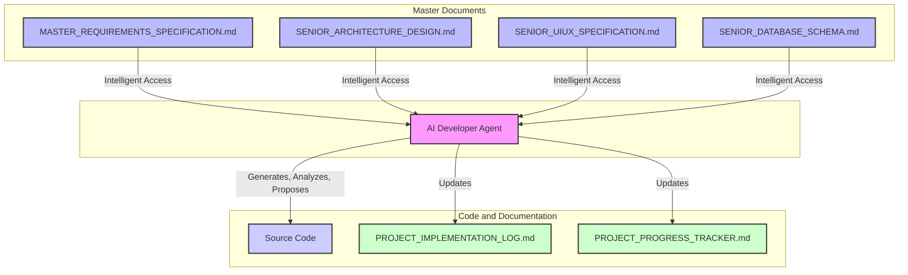

# Part 5: Phase 2 – Collaborative Implementation

### Table of Contents

* [Part 1: AI in Development](part1_intro_ai_development.md)
* [Part 2: Philosophy of Collaboration](part2_philosophy_collaboration.md)
* [Part 3: Kilo Code and AI Agents Setup Guide](part3_practical_guide_kilo_code_setup.md)
* [Part 4: Phase 1 - Holistic Planning](part4_phase1_planning_ai_architect.md)
* **Part 5: Phase 2 - Collaborative Implementation**
* [Part 6: Best Practices for Synergy](part6_best_practices_synergy.md)
* [Part 7: Critical Analysis of the Methodology](part7_critical_analysis_methodology.md)
* [Part 8: Conclusion – Augmented Development](part8_conclusion_augmented_development.md)
* [Part 9: Resources and Community](part9_resources_communaute.md)

---

* **Part 5: Phase 2 – Collaborative Implementation**
  * [The Subtle Art of Materialization](#the-subtle-art-of-materialization)
  * [Invoking the Digital Master Craftsman](#invoking-the-digital-master-craftsman)
    * [Elite Co-Developer](#elite-co-developer)
    * [Leveraging Specifications](#leveraging-specifications)
  * [Implementation Workflow](#implementation-workflow)
    * [Prelude to Action](#prelude-to-action)
    * [Construction Site Logging](#construction-site-logging)
    * [Progress Tracking](#progress-tracking)
  * [Scenarios of Co-Development](#scenarios-of-co-development)
    * [Contextualized Code Generation](#contextualized-code-generation)
    * [Option Exploration](#option-exploration)
    * [Intelligent Code Review](#intelligent-code-review)
    * [Co-Elaboration of Testing Strategies](#co-elaboration-of-testing-strategies)
  * [Evolution Management](#evolution-management)
  * [Mastered Autonomy](#mastered-autonomy)
  * [Collaborative Debriefing](#collaborative-debriefing)

---
### The Subtle Art of Materialization

If Phase 1 of our collaborative methodology was akin to the meticulous design of a cathedral's plans by a college of visionary architects and master builders – yielding master documents (`MASTER_REQUIREMENTS_SPECIFICATION.md`, `SENIOR_ARCHITECTURE_DESIGN.md`, `SENIOR_UIUX_SPECIFICATION.md`, and `SENIOR_DATABASE_SCHEMA.md`) that are true testaments to rigor and foresight – Phase 2 is where the builders enter the scene with their sharpest tools. It is the exhilarating art of **materialization**, the transformation of these "gold-standard blueprints" into a tangible, functional, and living structure: your application's source code.

The common mistake at this critical juncture would be to assume that, with such excellent plans, AI can now "code everything automatically," relegating you to the role of a mere spectator. As we have thoroughly established, such an approach, even with the world's best specifications, still exposes **the AI agent** to risks of misinterpretation, lack of contextual finesse, and a loss of that human touch which distinguishes merely functional code from truly elegant, maintainable, and performant code. This is why we will continue and intensify our **philosophy of intelligent collaboration and enlightened human control**. We will activate our second specialized AI agent, the "Senior Collaborative Full-Stack Developer," whose mission is not to replace you or dictate terms, but to become your **expert and devoted co-craftsman**, your top-tier technical partner in translating, with surgical precision, unwavering rigor, and constant discernment, these demanding specifications into **code of a quality and robustness that directly reflect the excellence of the design**. The objective is to orchestrate a true alchemy, where your strategic vision, your irreplaceable business expertise, and your critical judgment combine with AI's generative power, analytical capabilities, and deep technical knowledge, in a ballet of co-creation that is both productive and qualitatively superior.

### Invoking the Digital Master Craftsman

To initiate this software construction phase, your first action will be to **manually switch** within your Kilo Code interface to the agent you have meticulously configured for this mission (e.g., under the name "My Excellence AI Co-Developer," loading the `AGENT_SENIOR_COLLABORATIVE_DEVELOPER_EN.md` system prompt). This change of "custom mode" is not trivial; it signals to your development environment that you are now engaging with an AI instance specifically honed and instructed for the complex challenges and quality demands of full-stack implementation.

#### Elite Co-Developer

The "Senior Collaborative Full-Stack Developer" far transcends the role of a simple on-demand code generator or syntax completion assistant. It is designed, through the richness of its system prompt, to embody your **privileged and proactive technical alter ego**, a virtual lead developer bringing a synergy of skills and attitudes indispensable for excellence:

* **Versatile, Up-to-Date, and Contextualized Full-Stack Technical Expertise (Conceptual):** Thanks to the power of the underlying Large Language Models (like Gemini 2.5 Pro or Flash) that animate it, it possesses vast and deep conceptual knowledge of major programming languages and their ecosystems (Python, JavaScript/TypeScript, Java, C#, Go, Rust, etc.), frontend frameworks (React, Angular, Vue, Svelte, and their toolings) and backend frameworks (Node.js/Express, Django/Flask, Spring Boot, .NET Core, and their ORMs/ODMs), complex and optimized database interactions (SQL and NoSQL), design and securing of robust RESTful or GraphQL APIs, fundamental principles of application security (OWASP and beyond), performance optimization techniques (algorithmic, system, network), and proven as well as emerging software design patterns.
* **Inflexible Guardian and Faithful Interpreter of Validated Specifications:** Its prime directive, its immutable North Star, is to **translate with absolute fidelity and contextual intelligence** the decisions, constraints, and details enshrined in the four master documents from Phase 1. It is explicitly instructed to scrupulously respect them in every line of code it proposes and to immediately and **proactively** alert you (see Dev Mandate 7) if any of your implementation requests or its own technical initiatives seem to deviate, however subtly or for seemingly good reasons, from what has been formally validated and documented. It is not here to reinvent the project, but to materialize it with excellence.
* **Active, Meticulous, and Tireless Documentarian:** One of its distinctive and highly valuable features, designed to offload a task often perceived as tedious but nonetheless essential from the human developer, is its ability, under your supervision and with your final validation for each file write, to **quasi-automatically create and update project journals** (`PROJECT_IMPLEMENTATION_LOG.md`) that trace every significant contribution and implementation decision, as well as **progress tracking dashboards** (`PROJECT_PROGRESS_TRACKER.md`) that offer clear, real-time visibility on development advancement.
* **Strategic Advisor for Implementation and Technical Decision Partner:** It does not merely execute passively. It is "prompted" to be an intelligent sounding board and a source of proactive proposals. It can analyze alternative implementation options for a given feature, discuss with you the inherent technical trade-offs (e.g., performance vs. algorithmic complexity vs. development time vs. code readability), alert you to potential technical challenges or hidden dependencies you might not have anticipated, and help you, through justified comparative analyses, make the most enlightened and long-term-aligned implementation decisions.

#### Leveraging Specifications

The exceptional power and relevance of this AI agent during Phase 2 stem directly, and exponentially, from the **quality, depth, and exhaustiveness of the monumental planning and specification work accomplished in Phase 1**. The four master documents – `MASTER_REQUIREMENTS_SPECIFICATION.md`, `SENIOR_ARCHITECTURE_DESIGN.md`, `SENIOR_UIUX_SPECIFICATION.md`, and `SENIOR_DATABASE_SCHEMA.md` – are not just reading material for it; they constitute its **fundamental and dynamic contextual knowledge base, its "ground truth" for every aspect of the project, its single and undisputed referential.**

Its system prompt explicitly and insistently instructs it to:

1. **Consider these four documents as the sole, canonical, and authoritative source** for all functional and non-functional specifications, all architectural decisions, all UI/UX design directives, and the entire data schema structure. **No other source (unless explicitly and validatedly instructed by you) should prevail.**
2. When an implementation task is submitted by you, or when it prepares an action plan, it must **autonomously and proactively search and consult the relevant and specific sections** within these four documents (using Kilo Code's file reading capabilities, which you facilitate by pointing it to the reference files via `@file` mentions, especially at the start of a project or a major work session on a new module) to extract with surgical precision all the context necessary for the completion of that task.
3. **Immediately and argumentatively flag to you any ambiguity, missing information, apparent contradiction, or specification that would seem technically unfeasible or suboptimal** that it might detect in these documents in relation to the specific implementation task requested. Its role is also to contribute, through its technical lens, to the continuous improvement of the specifications themselves (see Dev Mandate 7 on change management).

This capacity for (prompt-guided) autonomous access and interpretation of the project's exhaustive documentary corpus dramatically reduces the need for you, the human developer, to constantly "re-explain the world" to the agent or to manually "feed" it context with every new interaction. It becomes more proactive, more autonomous in its information retrieval within the rigorous framework you have jointly defined, allowing you to focus on the noblest aspects of software creation: solving complex problems and making strategic decisions.



### Implementation Workflow

For maximum efficiency, flawless traceability of every contribution, and a truly synergistic collaboration where you always maintain strategic control, the interaction with the "Senior Collaborative Full-Stack Developer" is embedded within a structured workflow. In this workflow, the agent does not merely execute; it actively participates (under your enlightened direction and with your constant validation for every impactful action) in the granular planning of its own implementation tasks, the act of coding itself with a demand for quality, and the rigorous documentation of progress and decisions.

#### Prelude to Action

Before your AI partner embarks on writing even a single line of code for a feature of some magnitude, a complete user story, or a technical module with structural implications, a **collaborative and transparent micro-planning phase** is not merely recommended; it is **imperatively required by its system prompt (Dev Mandate 2)**. The agent is instructed, either **on its own initiative** or following your initial request for a task, to **propose a detailed, justified, and strategic action plan**, which will be submitted for your critical analysis, potential amendments, and formal validation.

> **You:** "We will now focus on implementing User Story US-075, which concerns the setup of a user comment moderation system before publication. The functional details are in `MASTER_REQUIREMENTS_SPECIFICATION.md` (section Z.Y.X) and its integration into the content and admin services architecture is outlined in `SENIOR_ARCHITECTURE_DESIGN.md` (section A.B.C)."
>
> **Senior Collaborative Full-Stack Developer:** "Perfectly noted for User Story US-075 (Comment Moderation System). This is a feature that is both critical for platform quality and sensitive in terms of workflow and permissions. Before any code generation, and after thoroughly consulting the specifications you referenced in our master documents, here is the detailed action plan I propose for a robust and aligned implementation:
>
> 1. **In-depth Contextual Analysis and Consolidation Phase:**
>    * Intensive and cross-referenced review of US-075, its associated acceptance criteria, and sections on "Administrator" and "Moderator" roles in `MASTER_REQUIREMENTS_SPECIFICATION.md`.
>    * Detailed examination of impacts on `SENIOR_DATABASE_SCHEMA.md`: it is highly probable that a new `status` field (e.g., 'PENDING_MODERATION', 'APPROVED', 'REJECTED', 'EDITED_BY_MODERATOR') will be necessary for the `Comments` entity. Furthermore, a `ModerationActionsLog` table might be required to trace every moderation action. I will verify if these elements have already been anticipated; if not, I will submit an update proposal for this document first (in accordance with our change management process, see section 5.4). For this plan, I will assume the schema is ready or will be adapted accordingly.
>    * Analysis of `SENIOR_ARCHITECTURE_DESIGN.md` directives concerning the architecture of content management services, admin APIs, and any event buses for notifying authors or moderators.
>    * Consultation of `SENIOR_UIUX_SPECIFICATION.md` to anticipate the functional needs of the moderation admin interface (list of pending comments, comment display, action options, field for rejection/editing reason), even if detailed design will be frontend implemented.
> 2. **Backend Service Design and Development (`CommentModerationService`):**
>    a.  Proposal to create (or modify if a comment management service already exists) a dedicated service, for example, `CommentModerationService.java` (if our stack is Java/Spring).
>    b.  Definition of this service's key methods: `submitCommentForModeration(commentData)`, `getPendingComments(page, size, filters)`, `getCommentDetailsForModeration(commentId)`, `approveComment(commentId, moderatorId)`, `rejectComment(commentId, moderatorId, rejectionReason)`, `allowCommentEditByModerator(commentId, newContent, moderatorId)`.
>    c.  Implementation of the business logic for each method, including comment state changes, database interaction to persist statuses and moderation logs, and potential event publishing (e.g., `CommentApprovedEvent`, `CommentRejectedEvent`) if an EDA is in place.
> 3. **Development or Adaptation of Admin API Endpoints:**
>    a.  Creation (or modification) of secure API routes (access strictly reserved for "Administrator" and "Moderator" roles, according to specifications) to expose the `CommentModerationService` functionalities.
>    b.  Clear definition of Data Transfer Objects (DTOs) for the requests and responses of these endpoints, ensuring their compliance with project API standards.
> 4. **Modification of the User Comment Submission Flow:**
>    a.  The service or controller currently handling new comment submissions by users will need to be modified so that new comments are systematically marked with an initial status (e.g., 'PENDING_MODERATION') and inserted into the queue or management mechanism for comments for moderation.
> 5. **Specific Points of Attention and Non-Functional Requirements to Address:**
>    * **Security:** Ensure that only users with appropriate rights can access moderation functions and change comment statuses. Prevent any unauthorized manipulation.
>    * **Performance:** If the volume of comments to moderate is potentially high, ensure that listing and processing pending comments are performant.
>    * **Traceability and Auditability:** Every moderation action (approval, rejection, edit) must be rigorously logged (who, what, when, why), as specified in `PROJECT_IMPLEMENTATION_LOG.md` and potentially in the `ModerationActionsLog` table.
>    * **Notification (if specified):** Implement mechanisms to notify the comment author of the moderation outcome.
> 6. **Initial Testing Strategy to Consider:**
>    * Exhaustive unit tests for each method of `CommentModerationService`, covering all nominal and error cases.
>    * Integration tests for the admin API endpoints, mocking dependencies as necessary.
>    * Functional test scenarios to validate the complete moderation workflow from an administrator's perspective.
>
> Does this detailed action plan seem like an adequate and comprehensive roadmap before we begin to detail, for example, the precise interface of the `CommentModerationService` and the implementation of its first method?"

This upfront dialogue about the action plan is fundamental. It allows you, as the project's pilot, to validate the agent's interpretation, anticipate complexities, correct course if its approach doesn't seem optimal, and ensure that you and your AI partner are perfectly synchronized before the main coding effort begins. This is key to avoiding costly misunderstandings and unnecessary iterations.

#### Construction Site Logging

To guarantee absolute traceability of every technical decision, every code modification, and every significant advance in the project, the "Senior Collaborative Full-Stack Developer" agent is explicitly instructed (via its system prompt, Dev Mandate 8) to **create and automatically update** a detailed work log: the `PROJECT_IMPLEMENTATION_LOG.md` file. This task, although crucial for maintenance, team communication, and historical understanding of the project, is often perceived as tedious by developers. Our approach aims to automate it as much as possible, while keeping you in the loop for supervision.

* **Automated Initial Log File Creation (Proposed by Agent):** If the `PROJECT_IMPLEMENTATION_LOG.md` file does not yet exist at your project root (or in a `docs/` subfolder you might have specified), the agent, upon its first significant code contribution that is formally validated by you, will **propose to create this file** with a structured first log entry.
* **Detailed Automated Update After Each Validated Significant Task:** The true power of this mechanism lies in its systematic and (proposed) automated nature. After each implementation task (whether it's a new feature, a major bug fix, or an important refactoring) that you have **explicitly validated as complete, correct, and integrated** (by you or with its help) into the main codebase (e.g., after a Pull Request merge), the agent will **generate on its own a structured, detailed, and informative log entry**. This entry will imperatively include at a minimum:

  * The **Precise Date and Time** of logging (in ISO 8601 UTC format).
  * The **AI Agent/Mode** involved (e.g., "Senior Collaborative Full-Stack Developer").
  * The **Human Developer(s)** who collaborated, supervised, and validated (your name or alias).
  * The **Unique Identifier of the Task, Feature, User Story, or Bug** concerned (e.g., US-075, F-MOD-001, BUG-1234, REFAC-002).
  * A list of the **Main Files Created or Significantly Modified** (with their full relative path from the project root, to facilitate navigation and future code reviews).
  * A **Concise but Precise and Technical Description of the Work Performed** (e.g., "Implementation of business logic and API endpoints for the comment moderation service, including comment state changes, logging of moderation actions in a dedicated table, and exposure of functionalities to administrator roles.").
  * **Explicit References to Master Specifications** (with IDs of requirements, architectural decisions, UI/UX specifications, or data schema elements that directly guided this implementation, e.g., "Based on US-075 of `MRS.md`, ARCH-ADMIN-MOD-002 of `SAD.md`, and DB-COMMENTS.status of `SDS.md`.").
  * **Key Technical Decisions or Specific Points of Attention** made during this implementation phase (e.g., "Choice of library X for input data validation due to its robustness.", "Optimization of the pending comments listing query by adding a composite index on Y and Z.", "Note: Author notification upon rejection is not yet implemented and will be covered by task F-MOD-NOTIF-001.").
    The agent will then **explicitly propose to you, via the Kilo Code interface, to add this formatted entry to the `PROJECT_IMPLEMENTATION_LOG.md` file**. The actual writing to the file will always require **your formal approval of the proposed action by Kilo Code**, ensuring you have had the opportunity to review, amend if necessary, and validate the log content before it is permanently persisted.

  > **Senior Collaborative Full-Stack Developer:** (After you've validated the full implementation of comment moderation and the code is merged) "Excellent, the US-075 comment moderation feature is now considered complete. To ensure traceability of our work, I have prepared the following entry, ready to be added to our `PROJECT_IMPLEMENTATION_LOG.md`:
  >
  > ```markdown
  > **-----------------------------------------------------------------------**
  > **Log Entry ID:** LOG-20250526-001
  > **Date:** 2025-05-26 16:45 UTC
  > **Developer(s):** Adonis Rwabira (Lead) & Senior Collaborative Full-Stack Developer (AI)
  > **Task/US ID:** US-075 - User Comment Moderation System
  >
  > **Files Created/Modified:**
  >   - `CREATE: src/main/java/com/example/services/CommentModerationService.java`
  >   - `CREATE: src/main/java/com/example/controllers/AdminCommentController.java`
  >   - `MODIFY: src/main/java/com/example/models/Comment.java` (added: `status` field, `moderationLog` relation)
  >   - `CREATE: src/main/java/com/example/models/ModerationActionLog.java`
  >   - `CREATE: src/test/java/com/example/services/CommentModerationServiceTest.java`
  >
  > **Summary of Work Done:**
  > Implemented the complete backend logic for the user comment moderation system. New comments are now queued with a 'PENDING_MODERATION' status. Administrators and moderators can approve, reject (with a reason), or edit comments via new secured API endpoints. All moderation actions are tracked in a dedicated `ModerationActionLog` table for auditability.
  >
  > **Specifications Referenced:**
  >   - `MASTER_REQUIREMENTS_SPECIFICATION.md`: US-075, F-ADMIN-MOD-001 to 005, ENF-SEC-ADM-001 (role-based access), ENF-AUDIT-002 (moderation logging).
  >   - `SENIOR_DATABASE_SCHEMA.md`: Modifications to `Comments` entity, creation of `ModerationActionLog` entity.
  >   - `SENIOR_ARCHITECTURE_DESIGN.md`: Adherence to Service Layer pattern (ARCH-PATT-SVC), API design conventions (ARCH-API-STD-001).
  >
  > **Key Technical Decisions/Notes:**
  >   - Used Java Enums for comment statuses (`PENDING`, `APPROVED`, `REJECTED`, `EDITED_USER`, `EDITED_MODERATOR`).
  >   - Implemented lightweight optimistic locking for concurrent moderation actions (to be stress-tested).
  >   - Email notifications to authors post-moderation will be handled by User Story US-076.
  > **-----------------------------------------------------------------------**
  > ```
  >
  > Do you approve adding this detailed entry to our `PROJECT_IMPLEMENTATION_LOG.md`? I can prepare the corresponding Kilo Code write action."
  >

This log becomes a living, granular, and tamper-proof chronicle of your project's evolution. It is invaluable for **decision traceability**, for **team communication** (even if the team is initially "you + your AI partners"), for facilitating **deferred code reviews** or **project audits**, and for serving as a **solid, factual reference** in case of chat session interruption, project resumption after a pause, or onboarding a new team member.

#### Progress Tracking

To maintain a clear, motivating, and dynamic overview of your project's progress against initial objectives and scope, we advocate for the use of a progress tracking file, for example, `PROJECT_PROGRESS_TRACKER.md`. This document, which you can structure as a simple list of major features, User Stories, or Epics from your `MASTER_REQUIREMENTS_SPECIFICATION.md`, each with key attributes like its Unique ID, a brief Description, its Priority (e.g., Critical, High, Medium, Low), its current Status (e.g., To Do, In Progress, In Review, In Test, Blocked, Done), its Planned/Actual Completion Date, and a direct reference to the corresponding entry in `PROJECT_IMPLEMENTATION_LOG.md` once completed, can also be maintained with the proactive and intelligent assistance of your AI agent.

* **Assisted Tracker Creation and Initialization:** At the very beginning of Phase 2, or at any time you deem it useful, you can ask the "Senior Collaborative Full-Stack Developer" agent to help you **create or initialize this `PROJECT_PROGRESS_TRACKER.md` file**. It can, for instance, autonomously parse the `MASTER_REQUIREMENTS_SPECIFICATION.md` (which you would provide in context via `@file`), extract the list of main features or User Stories (with their IDs and priorities if already defined), and format them into the tracking file with an initial status of "To Do" and placeholders for other information.
  > **You:** "To kick off this implementation phase effectively, I'd like us to set up our `PROJECT_PROGRESS_TRACKER.md`. Based on `@MASTER_REQUIREMENTS_SPECIFICATION.md` (sections 3 and 6), can you extract all functional requirements (F-XXX) and non-functional requirements (NFR-XXX) with 'Critical' or 'High' priority, and list them in a Markdown table for our tracker with columns: ID, Description, Priority, Status (initialized to 'To Do'), Assignee (initialized to 'Me/AI'), Target Date (leave blank for now)?"
  >
* **Proposed Automated and Contextualized Update After Task Completion and Logging:** The real efficiency and rigor gain here comes from the agent's ability to (almost) automatically update this tracker. When you validate that a feature or User Story is complete (and after the corresponding entry has been generated for `PROJECT_IMPLEMENTATION_LOG.md`), the "Senior Collaborative Full-Stack Developer" agent is instructed to **autonomously and on its own initiative propose the update of the corresponding item's status** in the `PROJECT_PROGRESS_TRACKER.md` file.
  > **You:** "The log entry for US-075 (Comment Moderation) is perfect and approved. We can consider this User Story as 'Done' and ready for integration testing."
  > **Senior Collaborative Full-Stack Developer:** "Excellent news! Based on this and our previous log entry (let's say LogID:20250526-001), I will prepare the update for `PROJECT_PROGRESS_TRACKER.md` to reflect the completion of US-075 and its move to 'In Testing' status:
  >
  > ```markdown
  > | ID     | Description                        | Priority | Status     | Assignee             | Completion   | Log Ref.        |
  > |--------|------------------------------------|----------|------------|----------------------|--------------|-----------------|
  > | US-075 | Comment Moderation                 | Critical | **In Test**  | Adonis Rwabira/SCSFD | *[Current Date]* | LOG-20250526-001|
  > ```
  >
  > *(If using a checklist format)*
  > `- [ / ] US-075: User comment moderation (Priority: Critical, Sprint: 2, Status: In Test, Completion: [Current Date], Log Ref: LOG-20250526-001)`
  > *(Checkbox changes from `[ ]` or `[ ]` to `[ / ]` for In Test, or `[x]` for Done)*
  >
  > Do you approve this update to the `PROJECT_PROGRESS_TRACKER.md` file? I can prepare the Kilo Code write action."
  >
* **Intelligent Querying Capability for Progress Tracking:** Beyond simple updates, you can also use the agent as a natural language query interface for your project tracker, asking it for summaries or specific views.
  > **You:** *(After providing the tracker context via `@PROJECT_PROGRESS_TRACKER.md`)* "Can you give me a summary of User Stories assigned to the 'Current Sprint' that are still in 'In Progress' or 'To Do' status, and list them in descending order of priority? Are there any critical tasks that seem blocked or overdue based on any target dates we might have set?"
  >

These tracking and logging files (`PROJECT_IMPLEMENTATION_LOG.md` and `PROJECT_PROGRESS_TRACKER.md`), whose maintenance is significantly eased and made more reliable by AI's proactive assistance (generating relevant content and proposing write actions, leaving you with final validation and control), are not mere administrative burdens. They become **essential steering instruments and persistent, shared sources of context** for both you and your AI partner. They enable the agent to understand the real-time progress and history of the project at any moment, to avoid redoing already accomplished work or proposing redundant actions, and to resume collaboration **smoothly** and efficiently even after a prolonged session interruption, a change of focus, or if you need to dive back into a part of the project several weeks or months later. They are the living memory of your software construction site.

### Scenarios of Co-Development

With an AI partner so deeply briefed by the exhaustive Phase 1 specifications and so proactive in planning and documenting its own tasks, the collaboration for writing the actual source code transcends mere assistance. It evolves into a true **exercise in strategic, high-caliber co-development**. You, as the lead human developer, orchestrate AI's capabilities to achieve a level of technical mastery, code quality, and implementation efficiency that would be exceedingly challenging to attain **working alone** or with less integrated AI tools.

#### Contextualized Code Generation

The objective here is no longer to solicit isolated, decontextualized code snippets from the AI. Instead, you actively involve it in the **construction of complete, robust software components that are intrinsically coherent with the overall architecture** and faithful to both functional and non-functional specifications. Every code proposal from the agent must be a demonstration of deep contextual understanding and adherence to sound engineering principles.

> **You:** "We will now implement the core of the `NotificationService` module (as defined in `SENIOR_ARCHITECTURE_DESIGN.md`, section 4.5), which must handle asynchronous, multi-channel (Email, SMS, In-App Push) notifications via our Kafka event bus (specified in ARCH-MSG-001). Based on requirements F-NOTIF-001 through F-NOTIF-005 (`MASTER_REQUIREMENTS_SPECIFICATION.md`) and the 'Strategy' pattern we validated for channel selection, can you generate the main structure of this service in [Project Language, e.g., Kotlin with Spring Boot]? This should include the `NotificationChannelStrategy` interface, basic implementations for `EmailChannel` and `SmsChannel`, and the main service class that will consume Kafka events and delegate sending to the correct strategy. Ensure robust error handling for each channel, detailed logging, and explain your choices for Kafka consumer configuration and notification event serialization/deserialization."
>
> **Senior Collaborative Full-Stack Developer:** "This is a cornerstone of our event-driven architecture. Here's a proposed structure for the `NotificationService` in Kotlin with Spring Boot, incorporating the Strategy pattern and Kafka event consumption:
>
> ```kotlin
> // NotificationChannelStrategy.kt
> interface NotificationChannelStrategy {
>     fun send(notification: NotificationRequest): Mono<NotificationResult> // Using Project Reactor for non-blocking I/O
> }
>
> // EmailChannel.kt
> @Component("emailChannel") // Spring bean name for dynamic injection
> class EmailChannel(/* dependencies: JavaMailSender, TemplateEngine */) : NotificationChannelStrategy {
>     private val logger = LoggerFactory.getLogger(EmailChannel::class.java)
>     override fun send(notification: NotificationRequest): Mono<NotificationResult> {
>         return Mono.fromCallable {
>             // Complex logic to format email using TemplateEngine with notification.payload
>             // Actual sending logic using JavaMailSender
>             logger.info("Email sent successfully to ${notification.recipient} for notification ID ${notification.id}")
>             NotificationResult(NotificationStatus.SENT, "Email sent to ${notification.recipient}")
>         }.subscribeOn(Schedulers.boundedElastic()) // Offload blocking I/O
>         .doOnError { e -> logger.error("Failed to send email for notification ID ${notification.id}: ${e.message}", e) }
>         // Potentially add retry logic here based on NFRs for reliability
>     }
> }
>
> // SmsChannel.kt
> @Component("smsChannel")
> class SmsChannel(/* dependencies: TwilioSmsClient or similar */) : NotificationChannelStrategy {
>     // Similar robust implementation for SMS, including error handling and logging
> }
>
> // NotificationService.kt
> @Service
> class NotificationService(
>     private val strategies: Map<String, NotificationChannelStrategy>, // Autowired map of all strategy beans
>     private val objectMapper: ObjectMapper // For JSON deserialization of event payloads
> ) {
>     private val logger = LoggerFactory.getLogger(NotificationService::class.java)
>
>     @KafkaListener(topics = ["\${app.kafka.topic.notifications}"], groupId = "\${app.kafka.group-id.notifications}", errorHandler = "notificationErrorHandler")
>     fun consumeNotificationEvent(eventPayload: String, @Header(KafkaHeaders.RECEIVED_KEY) key: String) {
>         logger.info("Received notification event with key $key: $eventPayload")
>         try {
>             val notificationRequest = objectMapper.readValue(eventPayload, NotificationRequest::class.java) // Define NotificationRequest DTO
>             val channelKey = notificationRequest.channelType.name.lowercase() + "Channel"
>             val strategy = strategies[channelKey]
>
>             if (strategy == null) {
>                 logger.error("No NotificationChannelStrategy found for channel type: ${notificationRequest.channelType} (key: $channelKey). Event will be sent to DLQ.")
>                 // Logic to send to Dead-Letter Queue (DLQ)
>                 return
>             }
>
>             strategy.send(notificationRequest)
>                 .doOnSuccess { result -> logger.info("Notification ID ${notificationRequest.id} processed with status: ${result.status}") }
>                 .doOnError { e -> logger.error("Error processing notification ID ${notificationRequest.id} via ${notificationRequest.channelType}: ${e.message}", e) 
>                                // Further error handling, DLQ, etc.
>                 }
>                 .subscribe() // Crucial for executing reactive flows
>         } catch (e: Exception) {
>             logger.error("Critical error deserializing or processing notification event (key: $key): $eventPayload", e)
>             // Send to DLQ
>         }
>     }
> }
> // (Data Transfer Objects like NotificationRequest.java, NotificationResult.java, and Enums like ChannelType.java, NotificationStatus.java would also be defined)
> ```
>
> **Key Technical Explanations and Justifications:**
>
> 1. **Strategy Pattern with Spring Dependency Injection:** The various `NotificationChannelStrategy` implementations are Spring `@Component` beans. The `NotificationService` receives an injected `Map` of these strategies, with keys psychology the bean names (e.g., "emailChannel"). This allows for dynamic strategy selection at runtime based on the `channelType` in the `NotificationRequest`. This is highly extensible.
> 2. **Asynchronous Kafka Consumer (`@KafkaListener`):** The service listens to the configured Kafka topic for notification events. Deserialization of the JSON event payload into a `NotificationRequest` DTO is handled by Jackson's `ObjectMapper`, which Spring Boot configures by default. I've included the Kafka message `key` for better logging and traceability. A custom `errorHandler` is specified for the listener for robust error management.
> 3. **Reactive Programming (Project Reactor - `Mono`):** I've used `Mono` for the `send` operations within strategies, which is idiomatic for non-blocking I/O in a Spring WebFlux/Reactor environment. The `subscribeOn(Schedulers.boundedElastic())` call ensures that potentially blocking I/O operations (like sending an email or SMS) are offloaded to a dedicated thread pool, preventing the Kafka listener thread from being blocked. The final `.subscribe()` on the reactive chain is essential to trigger its execution.
> 4. **Comprehensive Error Handling and Logging:** Each strategy should implement its own robust error handling and detailed logging. The main consumer logs critical failures like deserialization issues or an inability to find a strategy for a given channel, with clear intent to route problematic messages to a Dead-Letter Queue (DLQ) for later analysis and reprocessing, as per best practices for resilient messaging systems.
> 5. **Externalized Configuration:** Kafka topic names and consumer group IDs are correctly externalized via Spring's property placeholder mechanism (`\${...}`), allowing for different configurations per environment, in line with `SENIOR_ARCHITECTURE_DESIGN.md` principles.
>
> This initial structure provides excellent extensibility for adding new notification channels in the future (e.g., In-App Push, Slack) by simply creating a new `NotificationChannelStrategy` implementation and an_object_of_it_as_a_Spring_bean. Would you like us to now focus on the precise definition of the `NotificationRequest` DTO, or perhaps discuss the retry mechanisms for the `EmailChannel`?"

This level of deep, contextual, and justified code generation, coupled with proactive questioning about next steps and design details, ensures that the AI is not just a code monkey but a true engineering partner.

#### Option Exploration

When the specifications allow for technical latitude in solving a particular problem, or when you sense that a specific challenge might benefit from a more elegant, performant, or maintainable solution, the agent becomes your high-level technical consultant for exploring, comparing, and validating the optimal implementation path.

> **You:** "For managing the various states of a customer's subscription (F-SUB-007: 'PendingPayment', 'Active', 'PastDue', 'Suspended', 'Canceled', 'Expired') and the complex transitions between them, the `SENIOR_ARCHITECTURE_DESIGN.md` (section 5.3) suggests we explore either a 'State' design pattern or a more straightforward finite state machine (FSM) implementation. Could you provide a detailed comparative analysis of these two patterns specifically for our subscription module context, considering future extensibility (ease of adding new states or transitions), testability of the state logic, and overall implementation complexity? Then, propose a code skeleton for the option you deem most pertinent in [Project Language/Framework]."
>
> **Senior Collaborative Full-Stack Developer:** "This is a classic and critical design choice for managing entities with complex lifecycles. Let's analyze the 'State' pattern versus a simpler FSM for our `Subscription` entity:
>
> * **State Design Pattern (GoF):**
>   * **Principle:** Allows an object to alter its behavior when its internal state changes. The object will appear to change its class. Typically involves an interface (`SubscriptionState`) and concrete state classes (`PendingPaymentState`, `ActiveState`, etc.), each encapsulating behavior specific to that state. The `Subscription` context object would hold a reference to its current state object and delegate state-specific operations to it.
>   * **Advantages for Us:**
>     * **High Extensibility:** Adding new states or modifying transitions is achieved by creating new state classes or altering existing ones, often without touching the `Subscription` context class itself (Open/Closed Principle).
>     * **Excellent Cohesion:** Logic specific to each state is neatly encapsulated within its own class.
>     * **Clear State Transitions:** Transitions can be explicitly managed within each state class, making the FSM logic very clear.
>   * **Potential Drawbacks:** Can lead to a proliferation of small classes if there are many states and transitions. Initial setup might seem slightly more complex than a simple switch/if-else FSM.
> * **Simpler Finite State Machine (e.g., Enum + Switch/Conditional Logic):**
>   * **Principle:** The `Subscription` object would have a state attribute (e.g., an `Enum SubscriptionStatus`). Business methods would contain `switch` statements or `if-else if` chains to handle behavior based on the current status.
>   * **Advantages for Us:** Simpler to grasp conceptually for a small number of states. Less boilerplate code for a very simple FSM.
>   * **Potential Drawbacks:** As the number of states and transitions grows, the `switch` or `if-else` blocks in multiple methods can become very large, complex, and difficult to maintain (violating SRP and OCP). Adding new states often requires modifying multiple methods, increasing the risk of errors. Testability can be harder as logic is less isolated.
>     **Recommendation and Justification for Our Subscription Module:**
>     Given the number of states you've listed (at least six) and the likelihood of complex business rules and actions associated with each state transition (e.g., sending emails, calling payment gateways, updating related entities), the **State Design Pattern offers superior long-term maintainability, extensibility, and testability** for our `Subscription` entity. The initial overhead of creating separate state classes will be quickly offset by the clarity and a_g_e_n_c_y_ it provides as the logic evolves.
>
> Here is a conceptual skeleton in [Project Language/Framework] using the State pattern:
>
> ```[Project
> // SubscriptionStatusEnum (if needed for persistence/typing)
> public enum SubscriptionStatus { PENDING_PAYMENT, ACTIVE, PAST_DUE, SUSPENDED, CANCELED, EXPIRED }
>
> // State Interface
> public interface SubscriptionState {
>     void handlePaymentSuccess(SubscriptionContext context);
>     void handlePaymentFailure(SubscriptionContext context);
>     void handleRenewal(SubscriptionContext context);
>     void handleCancellationRequest(SubscriptionContext context);
>     SubscriptionStatus getStatus(); // To persist current state
> }
>
> // Concrete State Implementations
> public class ActiveState implements SubscriptionState {
>     @Override
>     public void handlePaymentSuccess(SubscriptionContext context) { /* Already active, maybe log or extend? */ }
>     // ... other methods, e.g., handleCancellationRequest would transition to CanceledState
>     @Override public SubscriptionStatus getStatus() { return SubscriptionStatus.ACTIVE; }
> }
> // ... classes for PendingPaymentState, PastDueState, CanceledState, etc. ...
>
> // Context Class (Your Subscription Entity/Service)
> public class SubscriptionContext { // Could be your @Entity or a service managing it
>     private SubscriptionState currentState;
>     // ... other subscription attributes (userId, planId, startDate, endDate) ...
>
>     public SubscriptionContext(SubscriptionState initialState) {
>         this.currentState = initialState;
>     }
>
>     public void setState(SubscriptionState newState) {
>         this.currentState = newState;
>         // Potentially persist this.currentState.getStatus() to DB
>     }
>
>     // Delegate operations to the current state
>     public void processPaymentSuccess() { currentState.handlePaymentSuccess(this); }
>     public void processPaymentFailure() { currentState.handlePaymentFailure(this); }
>     public void renew() { currentState.handleRenewal(this); }
>     public void requestCancellation() { currentState.handleCancellationRequest(this); }
>     public SubscriptionStatus getCurrentStatus() { return currentState.getStatus(); }
> }
> ```
>
> This structure clearly separates the logic for each state, making it highly modular and easier to test each state's behavior in isolation. The `SubscriptionContext` remains clean, merely delegating to its current state object. What are your thoughts on this direction before we flesh out the specific transitions?"

#### Intelligent Code Review

The AI agent is not merely a code generator; it is also an **indefatigable, systematic, and exceptionally knowledgeable code reviewer**. Leverage this capability constantly. When you write code, or when you and the AI co-develop a module, solicit its review. Be specific about your areas of concern to get the most targeted and valuable feedback.

> **You:** *(After providing the context of a critical module that handles sensitive financial transactions and user data, for instance, by using Kilo Code's `@file:src/core/finance/payment_processor.java` for a Java file)* "I would like an extremely rigorous and in-depth code review of this `payment_processor.java` module. My primary concerns, beyond simple functional correctness, are:
>
> 1. **Security and Compliance:** Identify any potential vulnerabilities (referencing OWASP Top 10, but also specifics of financial data handling, e.g., risks related to rounding, calculation precision, or compliance with standards like PCI-DSS if we were storing card numbers – which we are not here, but the rigor should be similar).
> 2. **Transactional Atomicity and Data Integrity:** Does the code guarantee that financial transactions are truly atomic (all-or-nothing) and that the integrity of financial data is preserved in case of errors or system failures (cf. ARCH-DB-TXN-001 from `SENIOR_ARCHITECTURE_DESIGN.md`)?
> 3. **Performance Under Load and Resource Optimization:** Are there any obvious bottlenecks or operations (loops, induced DB queries, memory allocations) that could become problematic under high transactional load (cf. NFR PERF-007 from `MASTER_REQUIREMENTS_SPECIFICATION.md`)?
> 4. **Readability, Maintainability, and Adherence to Design Principles:** Is the code sufficiently clear, well-commented (with an emphasis on the "why" of complex choices), is the business logic easy to follow for another developer? Does it respect SOLID and DRY principles? Is there any avoidable technical debt creeping in?"
>
> **Senior Collaborative Full-Stack Developer:** "I have conducted a detailed analysis of `payment_processor.java` focusing on your concerns. Here are my observations and prioritized recommendations:
>
> 1. **Security and Compliance:**
>    * **Critical Finding SEC-PAY-01:** The method `calculateFinalAmount` (line X) uses floating-point arithmetic (`double`) for monetary calculations. To prevent unpredictable rounding errors and ensure financial accuracy, it is imperative to use `BigDecimal` for all monetary values and calculations. **Recommendation:** Refactor all monetary DTOs and calculation logic to use `java.math.BigDecimal` with appropriate `MathContext` for rounding.
>    * **Warning SEC-PAY-02:** Sensitive transaction identifiers (e.g., `externalPaymentGatewayTxId`) appear to be logged in clear text in error logs (line Y). While not full card data, this could still be sensitive. **Recommendation:** Implement a masking strategy for sensitive IDs in logs or only log internal, non-sensitive correlation IDs.
> 2. **Transactional Atomicity and Data Integrity:**
>    * **Major Finding INT-PAY-01:** The database updates for `Order.status` and `PaymentLedger.transaction` (lines A to B) are performed as separate operations outside of a single, encompassing application-level or database transaction. If an error occurs after the first update but before the second, data inconsistency will result. This violates ARCH-DB-TXN-001. **Recommendation:** Ensure these operations are wrapped in a single `@Transactional` block (if using Spring) or an equivalent database transaction management mechanism to guarantee atomicity.
> 3. **Performance and Resource Optimization:**
>    * **Observation PERF-PAY-01:** The `lookupCustomerDetails` method (line C) is called within a loop that processes a batch of payments. If N payments are processed, N individual calls are made. This is a classic N+1 query anti-pattern. **Recommendation:** If possible, refactor to fetch customer details for the entire batch in a single, optimized query before the loop.
> 4. **Readability, Maintainability, and Design Principles:**
>    * **Observation MAINT-PAY-01 (SOLID - Single Responsibility Principle):** The `PaymentProcessor` class currently handles payment gateway communication, fraud detection logic, and ledger updates. These are distinct responsibilities. **Recommendation:** Consider decomposing this into `PaymentGatewayClient`, `FraudDetectionService`, and `LedgerService`, orchestrated by `PaymentProcessor`. This would significantly improve modularity, testability, and maintainability.
>    * **Observation MAINT-PAY-02 (Clarity):** Several complex conditional blocks (e.g., lines D-E) lack comments explaining the business rules they implement. **Recommendation:** Add concise comments clarifying the "why" of these specific logic branches.
>      I can assist you in outlining the refactoring for MAINT-PAY-01 (SRP), as it would have the most significant structural impact and improve all other aspects. Shall we start there?"

#### Co-Elaboration of Testing Strategies

A professional-quality application is not merely one that "works on my machine"; it is a system whose robustness, reliability, and compliance with requirements have been **rigorously and systematically validated through a multi-layered, well-thought-out testing strategy**. The AI, with its analytical capabilities and knowledge of testing best practices, becomes your invaluable partner in co-elaborating this strategy and in helping you generate test cases that go far beyond a cursory "happy path" check.

> **You:** "We now need to define and implement an exhaustive testing strategy for our new `UserAuthenticationService` module (referencing ARCH-AUTH-001 in `SENIOR_ARCHITECTURE_DESIGN.md` and F-AUTH-001 to F-AUTH-010 in `MASTER_REQUIREMENTS_SPECIFICATION.md`). This service handles user registration, login (password & 2FA), password reset, and token management, interacting with a user database and an external email service. Can you help me:
>
> 1. **Define the primary levels and types of tests** that are most relevant and cost-effective for this critical module (e.g., unit tests for business logic, integration tests for database interaction and external service calls, contract tests for the exposed API).
> 2. For the unit tests of the `AuthenticationLogic` class (which contains the core business rules), **identify the key equivalence classes and boundary value analyses** for the most important input parameters (e.g., email format, password complexity, 2FA token validity, password reset token lifecycle).
> 3. **Generate comprehensive unit test skeletons in [Project's Testing Framework, e.g., Spock for Groovy/Java, or pytest with Hypothesis for Python]** for at least 5 critical scenarios. These must include a successful login with 2FA, a failed login due to invalid password, a password reset request for an existing user, an attempt to use an expired password reset token, and a user registration with an already existing email. Show me how to effectively mock external dependencies like the `EmailServiceClient` and the `UserCredentialsRepository`."
>
> **Senior Collaborative Full-Stack Developer:** "Absolutely. A multi-layered testing strategy for `UserAuthenticationService` is paramount. Here's a proposed approach:
>
> 1. **Multi-Level Testing Strategy for `UserAuthenticationService`:**
>
>    * **Unit Tests (Primary Focus):** Target each public method of `AuthenticationLogic` and supporting utility classes. Goal: Validate internal business logic in complete isolation. Mock ALL external dependencies (database repositories, email services, token generators/validators if external). Aim for very high code and branch coverage (e.g., >95%).
>    * **Integration Tests (Targeted & Controlled):**
>      * Between `AuthenticationLogic` (or the service layer) and its actual database interaction (e.g., via `UserCredentialsRepository`) to validate CRUD operations, unique constraints, and data consistency. Use a dedicated in-memory or containerized test database.
>      * Between `AuthenticationService` and a *controlled mock* of the `EmailServiceClient` to validate the interaction flow (correct email content templating, correct recipient, handling of send failures). Consider Contract Testing (e.g., with Pact) if the Email Service is an external microservice with its own team, to ensure your mock aligns with the real API contract.
>    * **API-Level Integration/Contract Tests:** Test the exposed REST/GraphQL endpoints of the `AuthenticationController` (if applicable), mocking the service layer underneath, to validate request/response schemas, HTTP status codes, and authentication/authorization middleware.
>    * **Security Penetration Tests (Conceptual, for later phase):** While not generated here, the design should facilitate future security testing (e.g., for OWASP Top 10 vulnerabilities related to authentication).
> 2. **Equivalence Classes & Boundary Values for `AuthenticationLogic` (Examples):**
>
>    * `email`: {ValidFormat_New, ValidFormat_Existing, InvalidFormat_NoAt, InvalidFormat_NoDomain, Empty, Null}
>    * `password`: {Valid_Strong, Valid_Weak_But_Allowed, Invalid_TooShort, Invalid_NoSpecialChar, Empty, Null}
>    * `2FA_Token`: {Valid_Active, Valid_JustExpired, Invalid_Format, Tampered, Null}
>    * `PasswordResetToken`: {Valid_Active_ForUser, Valid_Expired_ForUser, Invalid_NonExistent, Valid_For_DIFFERENT_User}
> 3. **Unit Test Skeletons with [Framework - e.g., Spock for Groovy/Java]:**
>
>    ```groovy
>    // AuthenticationLogicSpec.groovy (Spock Example)
>    import spock.lang.Specification
>    // ... other imports for your classes, exceptions, etc.
>
>    class AuthenticationLogicSpec extends Specification {
>        def emailService = Mock(EmailServiceClient)
>        def userRepository = Mock(UserCredentialsRepository)
>        def passwordEncoder = Mock(PasswordEncoder) // Assuming a password encoder
>        def tokenService = Mock(AuthenticationTokenService) // For JWTs, 2FA tokens etc.
>
>        def authLogic = new AuthenticationLogic(userRepository, emailService, passwordEncoder, tokenService)
>
>        def "should successfully register a new user with valid details"() {
>            given: "A new user with valid registration data"
>            def registrationRequest = new RegistrationRequest("test@example.com", "ValidPassword1!", "Test User")
>            userRepository.findByEmail("test@example.com") >> Optional.empty()
>            passwordEncoder.encode("ValidPassword1!") >> "hashedPassword"
>            userRepository.save(_ as UserCredentials) >> { args -> args.id = "user-uuid"; args } // Simulate save & ID generation
>
>            when: "The user attempts to register"
>            def registeredUser = authLogic.registerNewUser(registrationRequest)
>
>            then: "A new user is created and an activation email is sent"
>            1 * emailService.sendActivationEmail("test@example.com", _)
>            assertNotNull registeredUser
>            assertEquals "test@example.com", registeredUser.getEmail()
>            // ... other assertions on user state ...
>        }
>
>        def "should fail registration if email already exists"() {
>            given: "A registration attempt with an existing email"
>            def registrationRequest = new RegistrationRequest("existing@example.com", "ValidPassword1!", "Test User")
>            userRepository.findByEmail("existing@example.com") >> Optional.of(new UserCredentials(/*...data for existing user...*/))
>
>            when: "The user attempts to register"
>            def exception = thrown(UserAlreadyExistsException) {
>                authLogic.registerNewUser(registrationRequest)
>            }
>
>            then: "A UserAlreadyExistsException is thrown and no email is sent"
>            assertNotNull exception
>            0 * emailService.sendActivationEmail(_,_)
>            0 * userRepository.save(_)
>        }
>
>        // ... More tests for login success (with 2FA), login failure, password reset flow, token expiration etc. ...
>    }
>    ```
>
>    This Spock skeleton demonstrates clear Given-When-Then blocks and Mockito-style mocking for dependencies. We can now proceed to detail each critical test case based on the equivalence classes and boundary values we identified."

### Evolution Management

  Even the most meticulous, visionary planning undertaken in Phase 1, assisted by an AI of exceptional caliber, cannot claim absolute omniscience against the inherently dynamic and often unpredictable nature of software development. As we delve into the tangible reality of code during implementation, new technical insights may emerge, a deeper understanding of user needs can crystallize, external constraints might evolve, or simply, more elegant or performant solutions, born from experimentation, may present themselves. Recognizing and embracing this organic component of iteration and adaptation is not a sign of flawed planning, but a hallmark of mature engineering.

  Our methodology, far from being a rigid prison, is designed to **integrate change management in a structured, traceable, and collaborative manner**. The objective is not to prevent evolution – which would be counterproductive and stifle innovation – but to ensure that every evolution is a **conscious, deliberate decision**, that its full impact is carefully assessed, and that our **master specification documents (the four pillars from Phase 1) perpetually remain the "single source of truth" for the project**, faithfully reflecting its actual state and its validated intentions. The "Senior Collaborative Full-Stack Developer" agent plays a crucial role here as both a guardian of coherence and a facilitator of this controlled evolution.

  The process for managing a change that impacts the initial specifications is as follows, and its observance is **imperative for maintaining project integrity**:

1. **Collaborative Identification and Precise Articulation of the Need for Change from Initial Specifications:**
   * This need can be identified by **you**, the human developer, as you code, test, or receive new user feedback. You might realize that a specification is incomplete, ambiguous, suboptimal, or that a new functional or technical opportunity presents itself that wasn't initially considered.
   * It can also be identified by the **AI agent itself**. In attempting to implement a feature according to the plans, it might, thanks to its logical processing and knowledge of best practices, encounter an unforeseen technical impossibility, a glaring inconsistency between two specifications, or identify a significantly better (simpler, more performant, more secure) way to meet a requirement, but one that would necessitate amending the original plans. (This is a manifestation of its proactive role and its deep "understanding" of the documents, as defined in its Dev Mandate 7).
2. **In-depth Dialogue and Analytical Exploration of Impact and Alternatives:**
   * Once a potential need for change is identified, you engage in a thorough discussion with the "Senior Collaborative Full-Stack Developer." The objective is to analyze with great precision:
     * The **exact nature** of the proposed change (What needs to be modified? Why is this change necessary or desirable?).
     * Its **full potential impact** across all dimensions of the system (functional, architectural, user interface, data structure).
     * Its implications for **non-functional requirements** (performance, security, maintainability, scalability).
     * Its effect on the project's **timeline, resources, and budget**.
   * The agent assists you in exploring **various options** to address this change, presenting their respective advantages, disadvantages, and risks.
3. **Enlightened and Strategic Decision-Making by the User:** After **reviewing** all relevant information and analyses, it is **you, and you alone, who makes the final strategic decision** to proceed with the specification modification or not. This decision must be fully informed of all implications.
4. **Formal and Prioritized Update of Phase 1 Master Documents – *An Indispensable and Non-Negotiable Prerequisite to Any Impacted Code Modification*:** This is a fundamental, inflexible tenet of our methodology to guarantee the long-term integrity of the "single source of truth." If a specification is to evolve, the relevant document(s) (`MASTER_REQUIREMENTS_SPECIFICATION.md`, `SENIOR_ARCHITECTURE_DESIGN.md`, `SENIOR_UIUX_SPECIFICATION.md`, `SENIOR_DATABASE_SCHEMA.md`) MUST be updated and validated *before* any line of code is written or modified to reflect this change.
   * You will then request the "Senior Collaborative Full-Stack Developer" (or, if the impact is profoundly strategic and cross-cutting, you might choose to re-engage the "Senior Solution Architect & Adaptive Partner" for this specific task) to **assist you in formulating the textual modification proposals** for the affected documents. Thanks to its intimate knowledge of the specifications, it can do so in a highly targeted, coherent, and professional manner.
     > **You:** "Following our user beta testing, it's clear that the two-step validation process for publishing an article (F-ARTICLE-PUB-002) is overly cumbersome. We've decided to simplify it to a single validation by a chief editor. This impacts the user flow, the admin interface, and potentially the article status enum in the database. Can you generate the proposed amendments for the relevant sections of `MASTER_REQUIREMENTS_SPECIFICATION.md` (for F-ARTICLE-PUB-002), `SENIOR_UIUX_SPECIFICATION.md` (for the SCREEN-ADMIN-ARTICLES), and `SENIOR_DATABASE_SCHEMA.md` (for the `Articles` entity and its statuses)?"
     >
5. **Rigorous Validation and Formal Application of Documentary Changes by the User:** You critically analyze and validate the modification proposals generated by the agent for the specification documents. Once you are fully satisfied, you are responsible for the **effective updating of the `.md` files** (either by doing it manually, or by requesting the agent to perform a write action, which you will then explicitly and carefully approve in Kilo Code after reviewing the diff).
6. **Systematic and Detailed Logging of the Specification Change:** The "Senior Collaborative Full-Stack Developer" agent is instructed to assist you in meticulously recording this decision to modify the specifications, its complete justification, its analyzed impact, and precise references to the amended documents and sections in the `PROJECT_IMPLEMENTATION_LOG.md`. This ensures absolute traceability of the project's evolution and the rationale behind it.
7. **Consequent, Coherent, and Mastered Adjustment of the Source Code:** It is **only after the reference documents have been formally updated and validated** that you (and the agent, under your explicit direction) will proceed with the necessary modifications to the source code to align it with the new specifications. The agent will then use these updated documents as its new "ground truth."

  This rigorous and disciplined change management cycle, though demanding conscious effort, is the guarantee that your documentation remains a living, relevant asset, and not an obsolete relic. It prevents the insidious and costly drift where the code gradually diverges from the plans, transforming future maintenance and evolution into a veritable minefield.

### Mastered Autonomy

  The considerable investment in creating exhaustive, high-quality documentation during Phase 1, coupled with the "Senior Collaborative Full-Stack Developer" agent's ability to intelligently consult this dynamic knowledge base and meticulously document its own actions (action plans, logging, progress tracking), opens up fascinating and increasingly realistic prospects for **enhanced AI autonomy in certain well-defined and lower-risk implementation tasks** – always, and this cannot be overstated, under **rigorous human supervision, explicit control, and systematic final validation**.

  With the advanced capabilities of tools like Kilo Code (access to the file system, execution of terminal commands – each such action being imperatively subject to your explicit approval for security and control reasons), one can legitimately envision an agent that could, upon your specific request or following a minutely validated action plan:

* **Generate complete skeletons for modules, services, or UI components**, including directory structure, initial files with basic imports, and essential dependencies, in strict adherence to the `SENIOR_ARCHITECTURE_DESIGN.md` and project naming/styling conventions.
* **Automatically apply code formatting tools** (like Prettier for JavaScript/TypeScript, Black for Python, Spotless for Java/Kotlin) or **linters** (ESLint, Pylint, Checkstyle, SonarLint integrated into the IDE) to the code it produces or that you submit to it, based on a style configuration file (e.g., `.prettierrc`, `pyproject.toml`, `.eslintrc.js`) you would have provided and referenced.
* **Execute build scripts or unit and integration test suites** (defined by you or co-designed with it), analyze the outputs (success, failure, specific error messages, code coverage), and even attempt **basic auto-corrections for simple, unambiguous, and low-risk errors** (e.g., fixing a typo in a variable name flagged by the linter, adjusting a missing import if the compilation error is explicit and the solution obvious, or reformatting a code portion according to rules).
* **Prepare draft Pull Requests (or Merge Requests)** on your version control system (Git), generating a clear and concise summary of changes made (based on entries in `PROJECT_IMPLEMENTATION_LOG.md`) and listing the User Stories or tasks concerned (from `PROJECT_PROGRESS_TRACKER.md`).

  However, it is **imperative and vital to maintain a posture of enlightened prudence, technical realism, and never to overestimate the current autonomous capabilities of Large Language Models**, even the most advanced ones like Gemini 2.5 Pro, for software projects of significant complexity and criticality:

* **The Limit of Nuanced and Holistic Understanding of Global Context:** Even with extraordinarily detailed documentation and access to project history, AI can still struggle to grasp all the subtleties, hidden interdependencies, the unwritten historical context of past decisions, or the evolving strategic priorities of a large project. It lacks that intuitive "big picture" understanding that a human deeply immersed in the project develops.
* **The Difficulty in Managing Radical Unforeseen Events, Deep Uncertainty, and Disruptive Novelty:** Specifications, however exhaustive, can never anticipate 100% of real-world scenarios or the technical constraints that will unexpectedly emerge during development. The ability to manage the unexpected, to improvise intelligently and creatively when faced with a new technological constraint or a particularly devious bug, or to find truly disruptive solutions that step outside the framework of known patterns, remains a fundamental prerogative of human intelligence, adaptability, and experience.
* **The Ceiling of Innovation and Complex Problem-Solving with High Algorithmic or Business-Domain Components:** For implementation challenges that require genuine algorithmic innovation (e.g., designing a novel custom machine learning algorithm, optimizing a computationally intensive process with specific constraints), a profound architectural refactoring not initially envisioned, or a fine, intuitive, and evolving understanding of a highly specific and constantly changing business domain, the creative intuition, accumulated experience, and abstract reasoning capacity of the human developer remain, and will remain for a long time, irreplaceable.
* **Final, Non-Delegable, and Assumed Responsibility (Security, Robustness, Ethics, Quality of Use):** Allowing an AI to generate, test (even basically), and certainly not deploy code into production without **rigorous, multi-layered, informed, and assumed human validation** for all critical aspects – the security of data and systems (active prevention of OWASP vulnerabilities and other attack vectors, infallible management of access and permissions), the integrity and correctness of fundamental business logic, the robustness and reliability of financial transactions or sensitive operations, the potential ethical and societal impacts of the application – is an unacceptable risk-taking in any serious and responsible professional context.

  Our methodology, therefore, aims to **maximize intelligent assistance and *reasonable, supervised, controlled, and validated* automation**. AI is a formidable lever for amplifying your technical expertise, for accelerating well-defined, repetitive, or intellectually low-value-added tasks, and for helping you maintain an exceptional level of quality and rigor. But it is in no way a substitute for your enlightened professional judgment, your sharp critical thinking, and your ultimate and entire responsibility as the creator and guarantor of the software solution. Use its autonomy potential **for tasks that offload you** and allow you to focus on what truly matters, but always maintain absolute control and vigilant supervision over all strategic decisions, the architectural and functional quality of the code, and the exhaustive validation of every deliverable before it impacts your users.

### Collaborative Debriefing

  To perfectly conclude each significant implementation cycle – whether it's the delivery of a complex feature, the resolution of a critical bug, or an intensive work session that has resulted in an important milestone – and to sustainably embed human-AI collaboration within a **virtuous dynamic of continuous improvement and mutual learning**, the "Senior Collaborative Full-Stack Developer" agent is explicitly instructed (via its Dev Mandate 9) to **systematically and on its own initiative propose a brief but structured and insightful collaborative debriefing**. This closing ritual occurs when you, the developer, verbally signify that the current task or work phase is completed to your full satisfaction. This is not a mere formality or polite gesture; it is a powerful, integrated mechanism designed to extract the quintessence of each collaborative experience.

* A. **Concise and Precise Summary of the Accomplished Task and Validated Deliverables.** (The agent demonstrates its understanding of what has been achieved).
* B. **Reflective Analysis of the Interaction from the AI's Perspective:** Identification of **Collaboration Strengths** (e.g., "Your provision of context X was particularly helpful") and **Challenges Encountered by the Agent itself** during this specific task (e.g., "I initially had difficulty interpreting requirement Y because Z was unclear to me").
* C. **Subtle and Constructive Improvement Avenues for Your Future Synergy (Diplomatic Feedback to the User):** The agent formulates 1 or 2 very respectful and targeted suggestions to optimize how you might interact with it in the future for similar tasks (e.g., "For refactorings of this nature, if you could specify the associated non-functional performance constraints upfront, it would help me target my proposals more quickly.").
* D. **Concrete Self-Suggestions for the Evolution of Its Own System Instructions (Intended for You, Adonis, for Continuous Improvement of Master Prompts):** Based on lessons learned from this specific task, the agent identifies 1 or 2 avenues for reflection or suggestions for modifications to its own system prompt, aiming to improve its proactivity, clarity, or ability to anticipate certain needs or problems. These suggestions are a goldmine for the evolution of the prompts you will share with the community.
* E. **Positive Conclusion of the Debriefing and Confirmation of Its Immediate Availability for New Instructions.** (The agent reiterates its role as a partner ready to continue the collaboration).

  This debriefing mechanism, initiated by the agent and conducted as an open and constructive dialogue, transforms every significant interaction into a **precious opportunity for mutual learning**. It allows you, as a user, to continuously refine your "art of prompting" and your understanding of the subtleties of collaborating with an advanced AI, while also providing you with insights to optimize your own processes. Simultaneously, the agent's self-suggestions for improving its own instructions, once collected, analyzed, and validated by you (potentially with the assistance of your "Agent Prompt Refinement Analyst" for a more global view), become the **primary engine for the continuous improvement and qualitative evolution of the master prompts** that you make available to the community. It's a true golden loop, where each project contributes to making the tool and the method even more performant and aligned over time and across experiences.

Now that we have explored in depth how synergy with our specialized AI agents can radically transform the planning (Phase 1) and implementation (Phase 2) phases of our software projects, aiming for an unparalleled level of excellence, rigor, and productivity, it is time to distill the secrets of a truly harmonious and fruitful human-AI interaction. [Part 6: Mastering the Interaction – Essential Best Practices for Optimal Human-AI Synergy](part6_best_practices_synergy.md) will provide you with a set of essential best practices and expert advice to make every dialogue with your agents as fluid, effective, and mutually enriching as possible, transforming each work session into a true creative and productive "dance."

**Previous part:** * [Part 4: Phase 1 – The Art of Strategic Co-Design – Holistic Planning with Your &#34;Senior Solution Architect &amp; Adaptive Partner&#34;](part4_phase1_planning_ai_architect.md)
