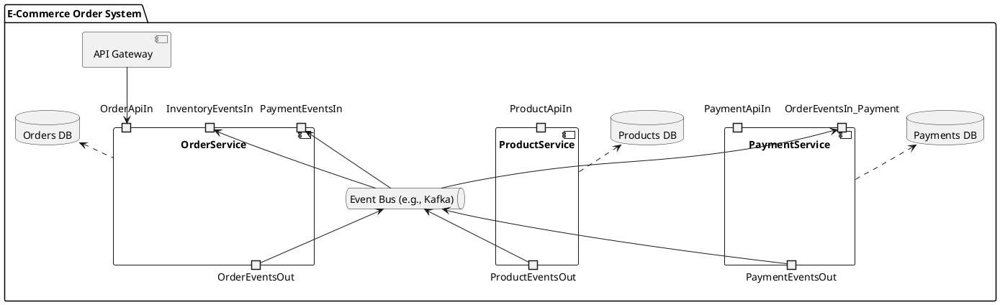
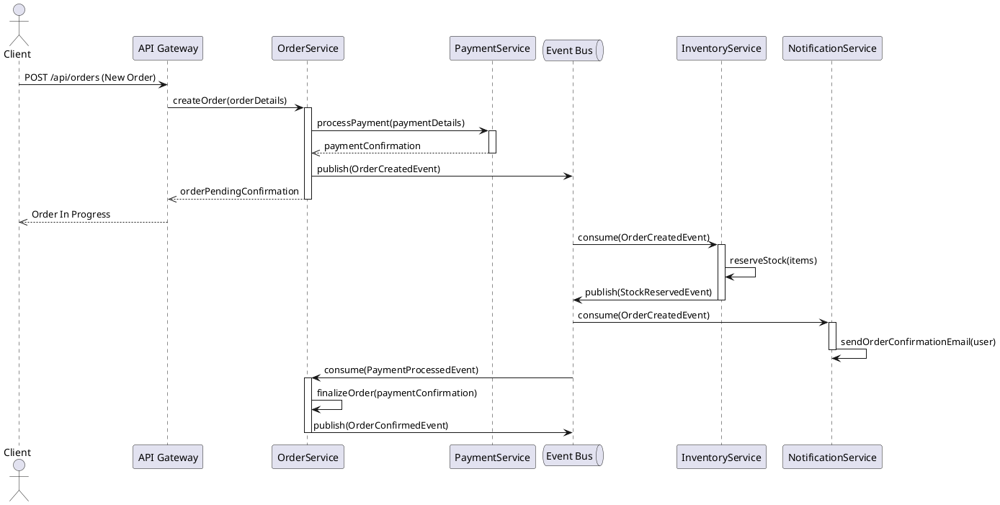

# EXAMPLE: Senior Architecture Design

This document is an example of architectural design, co-created with the AI Architect Agent. It serves as a blueprint for the project's technical implementation.

## 1. Introduction and Strategic Objectives

*   **Objective:** Define a robust, scalable, and secure architecture for the AI-augmented task management platform, aligned with functional and non-functional requirements.
*   **Guiding Principles:** Modularity, loose coupling, high cohesion, testability, security by design.

## 2. Architecture Overview

*   **Architectural Style:** Hexagonal Microservices (Ports & Adapters) on a Kubernetes platform with an Istio Service Mesh.
    *   **Justification:** This style promotes independent deployment, horizontal scalability, resilience, and ease of maintenance, while allowing clear isolation of business domains. The hexagonal approach ensures a clean separation between business logic and infrastructure details.

## 3. Architecture Decision Records (ADRs)

### ADR-001: Architectural Style Choice (Microservices)

*   **Problem Context:** The project requires high scalability, fault tolerance, and the ability to integrate new features quickly without impacting the entire system.
*   **Options Considered:** Monolith, Service-Oriented Architecture (SOA), Microservices.
*   **Decision Made:** Microservices.
*   **Detailed Justification:** Microservices offer the best granularity for independent component scaling, increased resilience (a failure in one service does not affect others), and technological flexibility. Although operational complexity is higher, the long-term benefits for a project of this scale are superior.
*   **Consequences:** Requires a deployment and orchestration infrastructure (Kubernetes), inter-service communication management (Event Bus, API Gateway), and a distributed monitoring strategy.
*   **Status:** Approved.

## 4. Component/Service/Module Decomposition

### OrderService

*   **Role:** Manage the lifecycle of orders.
*   **Responsibilities:** Creation, update, cancellation of orders; order status management.
*   **Exposed APIs:**
    *   `POST /orders`: Create a new order.
    *   `GET /orders/{id}`: Retrieve order details.
    *   `PUT /orders/{id}/status`: Update order status.
*   **Produced Events:** `OrderCreatedEvent`, `OrderUpdatedEvent`, `OrderCancelledEvent`.
*   **Dependencies:** `PaymentService` (synchronous), `Event Bus` (asynchronous).

### ProductService

*   **Role:** Manage the product catalog.
*   **Responsibilities:** Creation, update, deletion of products; stock management.
*   **Exposed APIs:**
    *   `GET /products/{id}`: Retrieve product details.
    *   `PUT /products/{id}/stock`: Update product stock.
*   **Produced Events:** `ProductUpdatedEvent`, `StockReservedEvent`.
*   **Dependencies:** No direct dependencies with other business services.

### PaymentService

*   **Role:** Manage payment transactions.
*   **Responsibilities:** Payment processing, refund management.
*   **Exposed APIs:**
    *   `POST /payments`: Process a payment.
*   **Produced Events:** `PaymentProcessedEvent`, `PaymentFailedEvent`.
*   **Dependencies:** External payment gateway.

## 5. Key Architecture Diagrams

### Component Diagram (PlantUML)

*   **Explanation:** This diagram illustrates the main microservices (`OrderService`, `ProductService`, `PaymentService`), the API Gateway, and the Event Bus as an asynchronous communication mechanism. It also shows the databases associated with each service.

### Sequence Diagram (PlantUML): Order Creation Flow

*   **Explanation:** This sequence diagram details the order creation flow, including the synchronous call to `PaymentService` and the asynchronous event publishing/consumption via the `Event Bus` by `InventoryService` and `NotificationService`.

## 6. Detailed Technology Stack

*   **Backend:**
    *   Language: Python 3.10+
    *   Framework: FastAPI (for REST microservices)
    *   Database: PostgreSQL (for `OrderService`, `ProductService`, `PaymentService`)
    *   Event Bus: Apache Kafka
*   **Frontend:**
    *   Framework: React.js
    *   Language: TypeScript
*   **Deployment:**
    *   Orchestration: Kubernetes
    *   Service Mesh: Istio
    *   Cloud Provider: AWS (EKS, RDS, MSK)

## 7. Detailed Strategies for Non-Functional Requirements

*   **Scalability:** All business services will be stateless and deployed in multiple instances behind a load balancer. Session data will be stored in a clustered Redis. Use of Kubernetes for horizontal auto-scaling.
*   **Security:** Authentication via OpenID Connect. All exposed APIs will be protected by JWT tokens validated by an API Gateway. Sensitive data in the database will be encrypted at rest using AES-256 via native DBMS capabilities.
*   **Performance:** Caching of frequently accessed data (popular products) via Redis. Asynchronous processing of non-critical operations (email sending, notifications) via the event bus.

## 8. Cross-Cutting Concerns

*   **Logging:** All services will produce structured JSON logs conforming to a defined schema, and send them to a centralized ELK stack via Filebeat. Each log must contain a unique correlation ID for distributed request tracing.
*   **Monitoring:** Exposure of Prometheus metrics by each service. Use of Grafana for dashboard visualization.
*   **Configuration:** Centralized configuration management via Kubernetes ConfigMap per environment.

## 9. Architectural Principles and Conventions

*   All inter-service communication must occur via OpenAPI-documented REST APIs or via the event bus.
*   No business logic should reside in the presentation layer (frontend).
*   Coupling between modules must be minimized via abstract interfaces.
*   Services must be autonomous and own their databases (Database per Service).

## 10. Revision History

| Version | Date       | Author    | Revision Description                                     |
| :------ | :--------- | :-------- | :------------------------------------------------------- |
| 1.0     | 2025-06-10 | Kilo Code | Initial document creation based on AI discussions        |