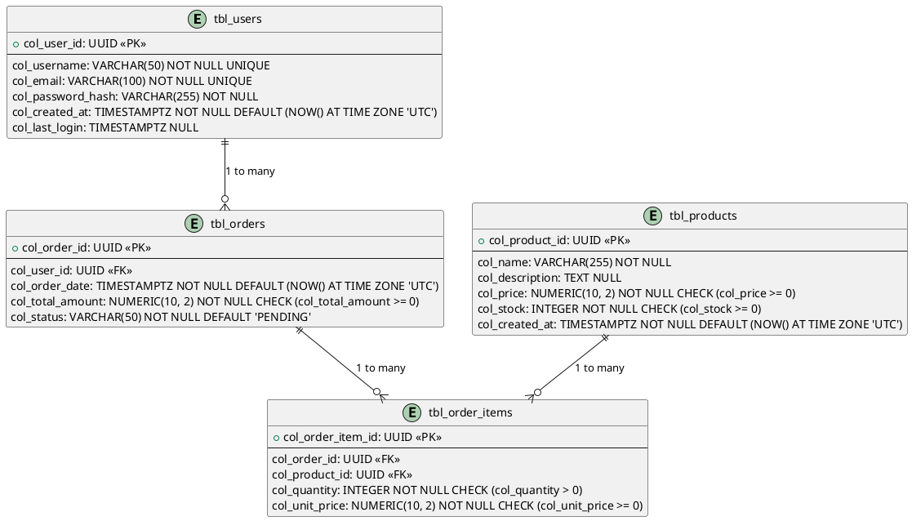

# Senior Database Schema

This document is an example of a database schema specification, co-created with the AI Architect Agent. It serves as a detailed atlas of the application's informational universe.

## 1. Introduction and Conventions

*   **Target DBMS:** PostgreSQL 16.2
*   **Naming Conventions:**
    *   Tables: `tbl_table_name` (e.g., `tbl_users`)
    *   Columns: `col_column_name` (e.g., `col_user_id`)
    *   Primary Keys: `pk_table_name`
    *   Foreign Keys: `fk_referencing_table_referenced_table`
    *   Indexes: `idx_table_columns`

## 2. Entity-Relationship Diagram (ERD)


*   **Explanation:** This Entity-Relationship Diagram illustrates the main entities (`Users`, `Products`, `Orders`, `Order_Items`) and their relationships.

## 3. Detailed Table Specification

### Table: `tbl_users`

*   **Description:** Stores platform user information.
*   **Columns:**
    *   `col_user_id`: `UUID PRIMARY KEY` - Unique user identifier.
    *   `col_username`: `VARCHAR(50) NOT NULL UNIQUE` - Unique username.
    *   `col_email`: `VARCHAR(100) NOT NULL UNIQUE` - Unique user email address.
    *   `col_password_hash`: `VARCHAR(255) NOT NULL` - Password hash (bcrypt).
    *   `col_created_at`: `TIMESTAMPTZ NOT NULL DEFAULT (NOW() AT TIME ZONE 'UTC')` - Account creation date and time.
    *   `col_last_login`: `TIMESTAMPTZ NULL` - Last login date and time.

### Table: `tbl_products`

*   **Description:** Contains details of available products.
*   **Columns:**
    *   `col_product_id`: `UUID PRIMARY KEY` - Unique product identifier.
    *   `col_name`: `VARCHAR(255) NOT NULL` - Product name.
    *   `col_description`: `TEXT NULL` - Detailed product description.
    *   `col_price`: `NUMERIC(10, 2) NOT NULL CHECK (col_price >= 0)` - Unit price of the product.
    *   `col_stock`: `INTEGER NOT NULL CHECK (col_stock >= 0)` - Quantity in stock.
    *   `col_created_at`: `TIMESTAMPTZ NOT NULL DEFAULT (NOW() AT TIME ZONE 'UTC')` - Product creation date.

### Table: `tbl_orders`

*   **Description:** Records orders placed by users.
*   **Columns:**
    *   `col_order_id`: `UUID PRIMARY KEY` - Unique order identifier.
    *   `col_user_id`: `UUID NOT NULL` - Reference to the user who placed the order.
        *   `FOREIGN KEY REFERENCES tbl_users(col_user_id) ON DELETE RESTRICT ON UPDATE CASCADE`
    *   `col_order_date`: `TIMESTAMPTZ NOT NULL DEFAULT (NOW() AT TIME ZONE 'UTC')` - Order date and time.
    *   `col_total_amount`: `NUMERIC(10, 2) NOT NULL CHECK (col_total_amount >= 0)` - Total amount of the order.
    *   `col_status`: `VARCHAR(50) NOT NULL DEFAULT 'PENDING'` - Current order status (e.g., 'PENDING', 'PROCESSING', 'COMPLETED', 'CANCELLED').

### Table: `tbl_order_items`

*   **Description:** Details the items included in each order.
*   **Columns:**
    *   `col_order_item_id`: `UUID PRIMARY KEY` - Unique order item identifier.
    *   `col_order_id`: `UUID NOT NULL` - Reference to the parent order.
        *   `FOREIGN KEY REFERENCES tbl_orders(col_order_id) ON DELETE CASCADE ON UPDATE CASCADE`
    *   `col_product_id`: `UUID NOT NULL` - Reference to the ordered product.
        *   `FOREIGN KEY REFERENCES tbl_products(col_product_id) ON DELETE RESTRICT ON UPDATE CASCADE`
    *   `col_quantity`: `INTEGER NOT NULL CHECK (col_quantity > 0)` - Quantity of the ordered product.
    *   `col_unit_price`: `NUMERIC(10, 2) NOT NULL CHECK (col_unit_price >= 0)` - Unit price of the product at the time of order.

## 4. Detailed Indexing Strategy

*   **`idx_users_email`:**
    *   Table: `tbl_users`
    *   Columns: `col_email`
    *   Type: B-Tree (Unique)
    *   Justification: Optimizes fast lookup by email for authentication and uniqueness checks.
*   **`idx_orders_user_id`:**
    *   Table: `tbl_orders`
    *   Columns: `col_user_id`
    *   Type: B-Tree
    *   Justification: Accelerates retrieval of all orders for a given user.
*   **`idx_order_items_order_id`:**
    *   Table: `tbl_order_items`
    *   Columns: `col_order_id`
    *   Type: B-Tree
    *   Justification: Optimizes retrieval of all items for a specific order.

## 5. Specific Data Security and Privacy Considerations

*   The `col_password_hash` field in `tbl_users` is stored as a hash using the bcrypt algorithm with an individual salt.
*   All sensitive data (e.g., payment information if stored) would be encrypted at rest and in transit.

## 6. DDL (Data Definition Language) Script Drafts

```sql
-- Create tbl_users table
CREATE TABLE tbl_users (
    col_user_id UUID PRIMARY KEY,
    col_username VARCHAR(50) NOT NULL UNIQUE,
    col_email VARCHAR(100) NOT NULL UNIQUE,
    col_password_hash VARCHAR(255) NOT NULL,
    col_created_at TIMESTAMPTZ NOT NULL DEFAULT (NOW() AT TIME ZONE 'UTC'),
    col_last_login TIMESTAMPTZ NULL
);

-- Create tbl_products table
CREATE TABLE tbl_products (
    col_product_id UUID PRIMARY KEY,
    col_name VARCHAR(255) NOT NULL,
    col_description TEXT NULL,
    col_price NUMERIC(10, 2) NOT NULL CHECK (col_price >= 0),
    col_stock INTEGER NOT NULL CHECK (col_stock >= 0),
    col_created_at TIMESTAMPTZ NOT NULL DEFAULT (NOW() AT TIME ZONE 'UTC')
);

-- Create tbl_orders table
CREATE TABLE tbl_orders (
    col_order_id UUID PRIMARY KEY,
    col_user_id UUID NOT NULL,
    col_order_date TIMESTAMPTZ NOT NULL DEFAULT (NOW() AT TIME ZONE 'UTC'),
    col_total_amount NUMERIC(10, 2) NOT NULL CHECK (col_total_amount >= 0),
    col_status VARCHAR(50) NOT NULL DEFAULT 'PENDING',
    CONSTRAINT fk_orders_user_id FOREIGN KEY (col_user_id) REFERENCES tbl_users(col_user_id) ON DELETE RESTRICT ON UPDATE CASCADE
);

-- Create tbl_order_items table
CREATE TABLE tbl_order_items (
    col_order_item_id UUID PRIMARY KEY,
    col_order_id UUID NOT NULL,
    col_product_id UUID NOT NULL,
    col_quantity INTEGER NOT NULL CHECK (col_quantity > 0),
    col_unit_price NUMERIC(10, 2) NOT NULL CHECK (col_unit_price >= 0),
    CONSTRAINT fk_order_items_order_id FOREIGN KEY (col_order_id) REFERENCES tbl_orders(col_order_id) ON DELETE CASCADE ON UPDATE CASCADE,
    CONSTRAINT fk_order_items_product_id FOREIGN KEY (col_product_id) REFERENCES tbl_products(col_product_id) ON DELETE RESTRICT ON UPDATE CASCADE
);

-- Create indexes
CREATE UNIQUE INDEX idx_users_email ON tbl_users (col_email);
CREATE INDEX idx_orders_user_id ON tbl_orders (col_user_id);
CREATE INDEX idx_order_items_order_id ON tbl_order_items (col_order_id);
```

## 7. Revision History

| Version | Date       | Author    | Revision Description                                     |
| :------ | :--------- | :-------- | :------------------------------------------------------- |
| 1.0     | 2025-06-10 | Kilo Code | Initial document creation based on AI discussions        |