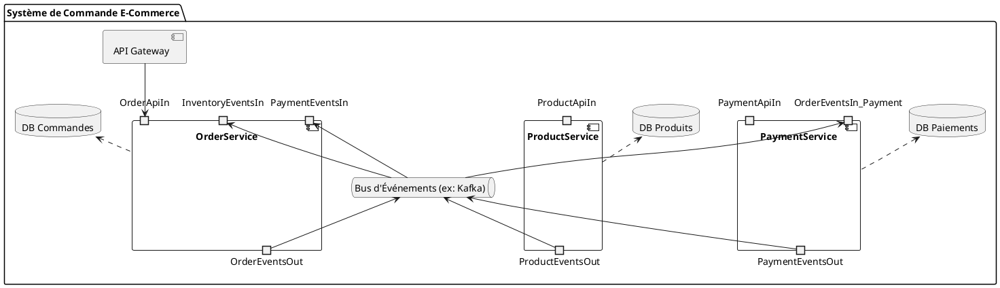
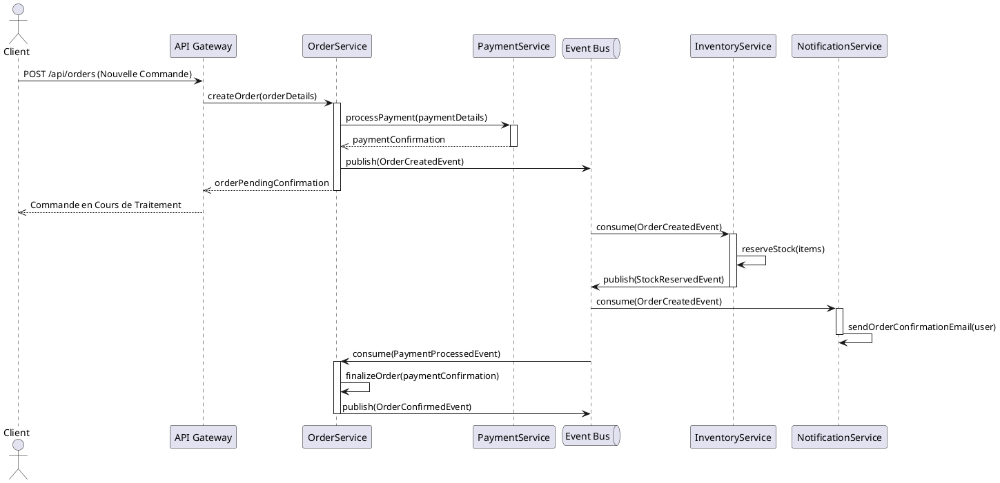

# EXEMPLE : Conception Architecturale Senior (Senior Architecture Design)

Ce document est un exemple de conception architecturale, co-créé avec l'Agent Architecte IA. Il sert de plan directeur pour l'implémentation technique du projet.

## 1. Introduction et Objectifs Stratégiques

*   **Objectif :** Définir une architecture robuste, évolutive et sécurisée pour la plateforme de gestion de tâches augmentée par l'IA, en alignement avec les exigences fonctionnelles et non-fonctionnelles.
*   **Principes Directeurs :** Modularité, couplage lâche, haute cohésion, testabilité, sécurité par conception.

## 2. Vue d'Ensemble de l'Architecture

*   **Style Architectural :** Microservices Hexagonaux (Ports & Adapters) sur une plateforme Kubernetes avec un Service Mesh Istio.
    *   **Justification :** Ce style favorise l'indépendance de déploiement, la scalabilité horizontale, la résilience et la facilité de maintenance, tout en permettant une isolation claire des domaines métier. L'approche hexagonale assure une séparation nette entre la logique métier et les détails d'infrastructure.

## 3. Architecture Decision Records (ADRs)

### ADR-001 : Choix du Style Architectural (Microservices)

*   **Contexte du Problème :** Le projet nécessite une haute scalabilité, une résilience aux pannes et la capacité d'intégrer de nouvelles fonctionnalités rapidement sans impacter l'ensemble du système.
*   **Options Envisagées :** Monolithe, Architecture Orientée Services (SOA), Microservices.
*   **Décision Prise :** Microservices.
*   **Justification Détaillée :** Les microservices offrent la meilleure granularité pour le scaling indépendant des composants, la résilience accrue (une panne dans un service n'affecte pas les autres), et la flexibilité technologique. Bien que la complexité opérationnelle soit plus élevée, les bénéfices à long terme pour un projet de cette envergure sont supérieurs.
*   **Conséquences :** Nécessite une infrastructure de déploiement et d'orchestration (Kubernetes), une gestion des communications inter-services (Event Bus, API Gateway), et une stratégie de monitoring distribué.
*   **Statut :** Approuvé.

## 4. Décomposition en Composants/Services/Modules

### OrderService

*   **Rôle :** Gérer le cycle de vie des commandes.
*   **Responsabilités :** Création, mise à jour, annulation de commandes ; gestion du statut de commande.
*   **API Exposées :**
    *   `POST /orders` : Créer une nouvelle commande.
    *   `GET /orders/{id}` : Récupérer les détails d'une commande.
    *   `PUT /orders/{id}/status` : Mettre à jour le statut d'une commande.
*   **Événements Produits :** `OrderCreatedEvent`, `OrderUpdatedEvent`, `OrderCancelledEvent`.
*   **Dépendances :** `PaymentService` (synchrone), `Event Bus` (asynchrone).

### ProductService

*   **Rôle :** Gérer le catalogue de produits.
*   **Responsabilités :** Création, mise à jour, suppression de produits ; gestion des stocks.
*   **API Exposées :**
    *   `GET /products/{id}` : Récupérer les détails d'un produit.
    *   `PUT /products/{id}/stock` : Mettre à jour le stock d'un produit.
*   **Événements Produits :** `ProductUpdatedEvent`, `StockReservedEvent`.
*   **Dépendances :** Aucune dépendance directe avec d'autres services métier.

### PaymentService

*   **Rôle :** Gérer les transactions de paiement.
*   **Responsabilités :** Traitement des paiements, gestion des remboursements.
*   **API Exposées :**
    *   `POST /payments` : Traiter un paiement.
*   **Événements Produits :** `PaymentProcessedEvent`, `PaymentFailedEvent`.
*   **Dépendances :** Passerelle de paiement externe.

## 5. Diagrammes d'Architecture Clés

### Diagramme de Composants (PlantUML)

*   **Explication :** Ce diagramme illustre les principaux microservices (`OrderService`, `ProductService`, `PaymentService`), l'API Gateway, et le Bus d'Événements comme mécanisme de communication asynchrone. Il montre également les bases de données associées à chaque service.

### Diagramme de Séquence (PlantUML) : Flux de Création de Commande

*   **Explication :** Ce diagramme de séquence détaille le flux de création d'une commande, incluant l'appel synchrone au `PaymentService` et la publication/consommation d'événements asynchrones via l'`Event Bus` par `InventoryService` et `NotificationService`.

## 6. Stack Technologique Détaillée

*   **Backend :**
    *   Langage : Python 3.10+
    *   Framework : FastAPI (pour les microservices REST)
    *   Base de données : PostgreSQL (pour `OrderService`, `ProductService`, `PaymentService`)
    *   Bus d'événements : Apache Kafka
*   **Frontend :**
    *   Framework : React.js
    *   Langage : TypeScript
*   **Déploiement :**
    *   Orchestration : Kubernetes
    *   Service Mesh : Istio
    *   Cloud Provider : AWS (EKS, RDS, MSK)

## 7. Stratégies Détaillées pour les Exigences Non-Fonctionnelles

*   **Scalabilité :** Tous les services métier seront stateless et déployés en multiples instances derrière un load balancer. Les données de session seront stockées dans un Redis clusterisé. Utilisation de Kubernetes pour l'auto-scaling horizontal.
*   **Sécurité :** Authentification via OpenID Connect. Toutes les API exposées seront protégées par des tokens JWT validés par une API Gateway. Les données sensibles en base seront chiffrées au repos en utilisant AES-256 via les capacités natives du SGBD.
*   **Performance :** Mise en cache des données fréquemment accédées (produits populaires) via Redis. Traitement asynchrone des opérations non critiques (envoi d'emails, notifications) via le bus d'événements.

## 8. Aspects Transversaux

*   **Logging :** Tous les services produiront des logs structurés au format JSON conformes à un schéma défini, et les enverront vers une stack ELK centralisée via Filebeat. Chaque log devra contenir un ID de corrélation unique pour le traçage des requêtes distribuées.
*   **Monitoring :** Exposition de métriques Prometheus par chaque service. Utilisation de Grafana pour la visualisation des tableaux de bord.
*   **Configuration :** Gestion centralisée de la configuration via ConfigMap Kubernetes par environnement.

## 9. Principes et Conventions d'Architecture

*   Toute communication inter-service doit se faire via des API REST documentées avec OpenAPI ou via le bus d'événements.
*   Aucune logique métier ne doit résider dans la couche de présentation (frontend).
*   Le couplage entre modules doit être minimisé via des interfaces abstraites.
*   Les services doivent être autonomes et posséder leurs propres bases de données (Database per Service).

## 10. Historique des Révisions

| Version | Date       | Auteur | Description de la Révision                               |
| :------ | :--------- | :----- | :------------------------------------------------------- |
| 1.0     | 2025-06-10 | Kilo Code | Création initiale du document basé sur les discussions IA |