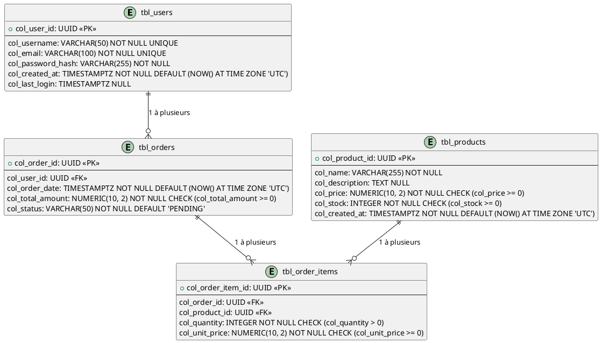

# Schéma de Base de Données Senior

Ce document est un exemple de spécification de schéma de base de données, co-créé avec l'Agent Architecte IA. Il sert d'atlas détaillé de l'univers informationnel de l'application.

## 1. Introduction et Conventions

*   **SGBD Cible :** PostgreSQL 16.2
*   **Conventions de Nommage :**
    *   Tables : `tbl_nom_table` (ex: `tbl_users`)
    *   Colonnes : `col_nom_colonne` (ex: `col_user_id`)
    *   Clés primaires : `pk_nom_table`
    *   Clés étrangères : `fk_table_ref_table_source`
    *   Index : `idx_table_colonnes`

## 2. Diagramme Entité-Relation (ERD)


*   **Explication :** Ce diagramme Entité-Relation illustre les principales entités (`Users`, `Products`, `Orders`, `Order_Items`) et leurs relations.

## 3. Spécification Détaillée de chaque Table

### Table : `tbl_users`

*   **Description :** Stocke les informations des utilisateurs de la plateforme.
*   **Colonnes :**
    *   `col_user_id` : `UUID PRIMARY KEY` - Identifiant unique de l'utilisateur.
    *   `col_username` : `VARCHAR(50) NOT NULL UNIQUE` - Nom d'utilisateur unique.
    *   `col_email` : `VARCHAR(100) NOT NULL UNIQUE` - Adresse email unique de l'utilisateur.
    *   `col_password_hash` : `VARCHAR(255) NOT NULL` - Hachage du mot de passe (bcrypt).
    *   `col_created_at` : `TIMESTAMPTZ NOT NULL DEFAULT (NOW() AT TIME ZONE 'UTC')` - Date et heure de création du compte.
    *   `col_last_login` : `TIMESTAMPTZ NULL` - Dernière date et heure de connexion.

### Table : `tbl_products`

*   **Description :** Contient les détails des produits disponibles.
*   **Colonnes :**
    *   `col_product_id` : `UUID PRIMARY KEY` - Identifiant unique du produit.
    *   `col_name` : `VARCHAR(255) NOT NULL` - Nom du produit.
    *   `col_description` : `TEXT NULL` - Description détaillée du produit.
    *   `col_price` : `NUMERIC(10, 2) NOT NULL CHECK (col_price >= 0)` - Prix unitaire du produit.
    *   `col_stock` : `INTEGER NOT NULL CHECK (col_stock >= 0)` - Quantité en stock.
    *   `col_created_at` : `TIMESTAMPTZ NOT NULL DEFAULT (NOW() AT TIME ZONE 'UTC')` - Date de création du produit.

### Table : `tbl_orders`

*   **Description :** Enregistre les commandes passées par les utilisateurs.
*   **Colonnes :**
    *   `col_order_id` : `UUID PRIMARY KEY` - Identifiant unique de la commande.
    *   `col_user_id` : `UUID NOT NULL` - Référence à l'utilisateur qui a passé la commande.
        *   `FOREIGN KEY REFERENCES tbl_users(col_user_id) ON DELETE RESTRICT ON UPDATE CASCADE`
    *   `col_order_date` : `TIMESTAMPTZ NOT NULL DEFAULT (NOW() AT TIME ZONE 'UTC')` - Date et heure de la commande.
    *   `col_total_amount` : `NUMERIC(10, 2) NOT NULL CHECK (col_total_amount >= 0)` - Montant total de la commande.
    *   `col_status` : `VARCHAR(50) NOT NULL DEFAULT 'PENDING'` - Statut actuel de la commande (ex: 'PENDING', 'PROCESSING', 'COMPLETED', 'CANCELLED').

### Table : `tbl_order_items`

*   **Description :** Détaille les articles inclus dans chaque commande.
*   **Colonnes :**
    *   `col_order_item_id` : `UUID PRIMARY KEY` - Identifiant unique de l'article de commande.
    *   `col_order_id` : `UUID NOT NULL` - Référence à la commande parente.
        *   `FOREIGN KEY REFERENCES tbl_orders(col_order_id) ON DELETE CASCADE ON UPDATE CASCADE`
    *   `col_product_id` : `UUID NOT NULL` - Référence au produit commandé.
        *   `FOREIGN KEY REFERENCES tbl_products(col_product_id) ON DELETE RESTRICT ON UPDATE CASCADE`
    *   `col_quantity` : `INTEGER NOT NULL CHECK (col_quantity > 0)` - Quantité du produit commandé.
    *   `col_unit_price` : `NUMERIC(10, 2) NOT NULL CHECK (col_unit_price >= 0)` - Prix unitaire du produit au moment de la commande.

## 4. Stratégie d'Indexation Détaillée

*   **`idx_users_email` :**
    *   Table : `tbl_users`
    *   Colonnes : `col_email`
    *   Type : B-Tree (Unique)
    *   Justification : Optimise la recherche rapide par email pour l'authentification et la vérification d'unicité.
*   **`idx_orders_user_id` :**
    *   Table : `tbl_orders`
    *   Colonnes : `col_user_id`
    *   Type : B-Tree
    *   Justification : Accélère la récupération de toutes les commandes d'un utilisateur donné.
*   **`idx_order_items_order_id` :**
    *   Table : `tbl_order_items`
    *   Colonnes : `col_order_id`
    *   Type : B-Tree
    *   Justification : Optimise la récupération de tous les articles pour une commande spécifique.

## 5. Considérations Spécifiques sur la Sécurité et la Confidentialité des Données

*   Le champ `col_password_hash` dans `tbl_users` est stocké sous forme de hachage utilisant l'algorithme bcrypt avec un sel individuel.
*   Toutes les données sensibles (ex: informations de paiement si elles étaient stockées) seraient chiffrées au repos et en transit.

## 6. Ébauches de Scripts DDL (Data Definition Language)

```sql
-- Création de la table tbl_users
CREATE TABLE tbl_users (
    col_user_id UUID PRIMARY KEY,
    col_username VARCHAR(50) NOT NULL UNIQUE,
    col_email VARCHAR(100) NOT NULL UNIQUE,
    col_password_hash VARCHAR(255) NOT NULL,
    col_created_at TIMESTAMPTZ NOT NULL DEFAULT (NOW() AT TIME ZONE 'UTC'),
    col_last_login TIMESTAMPTZ NULL
);

-- Création de la table tbl_products
CREATE TABLE tbl_products (
    col_product_id UUID PRIMARY KEY,
    col_name VARCHAR(255) NOT NULL,
    col_description TEXT NULL,
    col_price NUMERIC(10, 2) NOT NULL CHECK (col_price >= 0),
    col_stock INTEGER NOT NULL CHECK (col_stock >= 0),
    col_created_at TIMESTAMPTZ NOT NULL DEFAULT (NOW() AT TIME ZONE 'UTC')
);

-- Création de la table tbl_orders
CREATE TABLE tbl_orders (
    col_order_id UUID PRIMARY KEY,
    col_user_id UUID NOT NULL,
    col_order_date TIMESTAMPTZ NOT NULL DEFAULT (NOW() AT TIME ZONE 'UTC'),
    col_total_amount NUMERIC(10, 2) NOT NULL CHECK (col_total_amount >= 0),
    col_status VARCHAR(50) NOT NULL DEFAULT 'PENDING',
    CONSTRAINT fk_orders_user_id FOREIGN KEY (col_user_id) REFERENCES tbl_users(col_user_id) ON DELETE RESTRICT ON UPDATE CASCADE
);

-- Création de la table tbl_order_items
CREATE TABLE tbl_order_items (
    col_order_item_id UUID PRIMARY KEY,
    col_order_id UUID NOT NULL,
    col_product_id UUID NOT NULL,
    col_quantity INTEGER NOT NULL CHECK (col_quantity > 0),
    col_unit_price NUMERIC(10, 2) NOT NULL CHECK (col_unit_price >= 0),
    CONSTRAINT fk_order_items_order_id FOREIGN KEY (col_order_id) REFERENCES tbl_orders(col_order_id) ON DELETE CASCADE ON UPDATE CASCADE,
    CONSTRAINT fk_order_items_product_id FOREIGN KEY (col_product_id) REFERENCES tbl_products(col_product_id) ON DELETE RESTRICT ON UPDATE CASCADE
);

-- Création des index
CREATE UNIQUE INDEX idx_users_email ON tbl_users (col_email);
CREATE INDEX idx_orders_user_id ON tbl_orders (col_user_id);
CREATE INDEX idx_order_items_order_id ON tbl_order_items (col_order_id);
```

## 7. Historique des Révisions

| Version | Date       | Auteur | Description de la Révision                               |
| :------ | :--------- | :----- | :------------------------------------------------------- |
| 1.0     | 2025-06-10 | Kilo Code | Création initiale du document basé sur les discussions IA |
