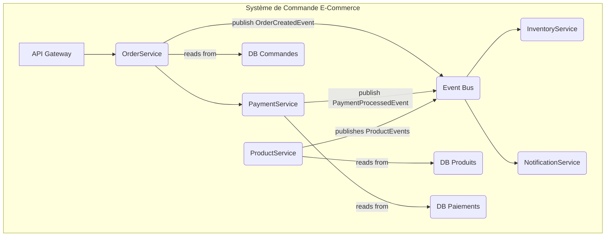

```mermaid
graph TD
    subgraph "Système de Commande E-Commerce"
        A[API Gateway] --> B(OrderService)
        B --> C(PaymentService)
        B -- "publish OrderCreatedEvent" --> D(Event Bus)
        C -- "publish PaymentProcessedEvent" --> D
        D --> E(InventoryService)
        D --> F(NotificationService)
        B -- "reads from" --> G(DB Commandes)
        H(ProductService) -- "reads from" --> I(DB Produits)
        C -- "reads from" --> J(DB Paiements)
        H -- "publishes ProductEvents" --> D
    end
```